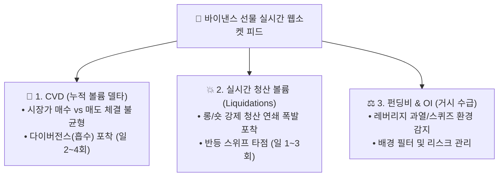
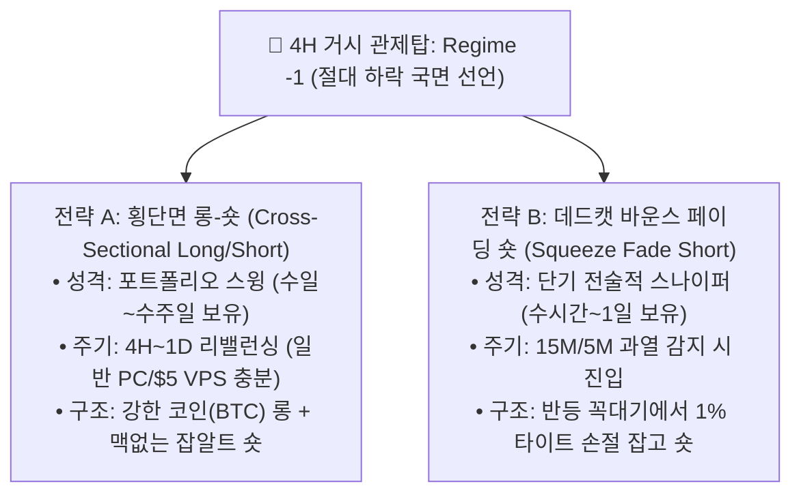

# 💡 차세대 퀀트 전략 및 미시구조 개선 아이디어 백로그
## (Institutional Crypto Quant Methodologies & Ideas for Strat 01/02)

* **문서 생성일:** 2026-09-04
* **문서 목적:** 상위 관제탑(전략 3) 연구 과정에서 발굴된 **기관 퀀트 펀드 및 금융공학 검증 방법론**을 아카이빙하고, 향후 **[전략 1(VWAP 스캘핑) 개선]** 및 **[전략 2(신규 전략) 기획]**의 핵심 빌딩 블록으로 활용.
* **적용 대상:** 
  * ⚡ [전략 1] 15M 고레버리지 스캘핑 정밀 타점 개선
  * 🚀 [전략 2] 신규 미시구조 기반 알파 전략 기획

---

## 1. 📊 정보 기반 바 (Information-Driven Bars: Dollar & Volume Bars)

### 1) 왜 기존 시간 기준 캔들(Time Bar: 15M, 1H)을 버려야 하는가?
* **시간 왜곡의 문제 (Marcos López de Prado):**
  * 암호화폐 시장은 주식 시장과 달리 24시간 연중무휴 작동합니다.
  * 새벽이나 주말처럼 거래가 거의 없을 때의 15분봉은 **순수한 노이즈**로 가득 차 있습니다.
  * 반대로 FTX 파산이나 CPI 발표처럼 1분 만에 수억 달러가 터지는 순간에는, 막대한 체결 정보가 **단 1개의 캔들로 압축되어 미시구조가 뭉개집니다.**
* **통계적 특성 붕괴:** 시간 기준 캔들은 수익률 분포가 심한 팻 테일(Fat-tail)과 비정상성(Non-stationarity)을 띄어 머신러닝이나 통계 지표를 교란합니다.

### 2) 대안: 달러 바 (Dollar Bars) 및 볼륨 바 (Volume Bars)
* **원리:** 시간의 흐름과 무관하게, **"누적 거래대금이 $10,000,000(1천만 달러) 터질 때마다 캔들 1개 생성"** (또는 $1,000\text{ BTC}$ 거래 시마다 1개 생성).
* **핵심 장점:**
  1. **정보 도착 속도에 비례한 샘플링:** 시장이 고요할 때는 1시간 동안 캔들이 1개도 안 생기지만, 폭락/폭등 빔이 터질 때는 5분 만에 캔들이 20개 생성되어 **미시구조의 붕괴 및 반등 꼬리를 극도로 정밀하게 관측 가능.**
  2. **수익률의 정규분포화:** 달러 바를 쓰면 가격 변화가 가우시안 정규분포에 훨씬 가까워져 기술적 지표(VWAP, 볼린저 밴드 등)의 통계적 신뢰도가 급상승함.

### 3) 개인 수준 인프라 구현 가이드
* **네트워크 & 컴퓨팅:** 월 $5~$10 수준의 클라우드 VPS(1 vCPU, 1GB RAM) 또는 가정용 PC로 충분.
* **실시간 수집:** 바이낸스 선물 공식 무료 웹소켓 `wss://fstream.binance.com/ws/btcusdt@aggTrade` 연결.
  ```python
  # 개념 코드 예시
  dollar_volume_accum = 0.0
  BAR_THRESHOLD = 10_000_000 # 1,000만 달러

  def on_agg_trade(trade):
      global dollar_volume_accum
      dollar_volume_accum += trade['price'] * trade['qty']
      if dollar_volume_accum >= BAR_THRESHOLD:
          emit_new_bar()
          dollar_volume_accum = 0.0
  ```
* **백테스트 데이터:** [Binance Data Vision](https://data.binance.vision/)에서 매일 무료로 제공하는 일별/월별 `aggTrade` 압축 CSV 활용 (Python Polars/Pandas로 수 분 내 전처리 가능).

---

## 2. ⚡ 오더플로우 및 파생상품 고유 미시구조 (Microstructure & Order Flow)

차트의 가격(OHLC)만을 가공한 후행 지표(RSI, MACD, ATR)를 탈피하고, **실제 수급의 물리적 불균형을 직접 측정**하는 3대 핵심 지표입니다.



### 1) CVD (Cumulative Volume Delta) 및 체결 흡수 (Absorption)
* **정의:** 시장가 매수 체결량(Buyer Taker Volume)에서 시장가 매도 체결량(Seller Taker Volume)을 뺀 누적값.
* **핵심 알파: CVD 다이버전스 (Absorption):**
  * 가격은 고점을 갱신하고 있는데 CVD는 하락하거나 정체되는 현상.
  * **원리:** 개미들이 시장가로 추격 매수(FOMO)를 넣고 있으나, 기관/고래가 지정가 매도 벽을 대고 물량을 전부 받아먹고(Absorption) 던질 준비를 하는 자리.
* **거래 빈도:** 15분/5분봉 기준 **하루 평균 2~4회** 발생 (전략 1의 일 1~3회 기준과 완벽 부합).

### 2) 단기 청산 스위프 (Liquidation Cascade & Sweep)
* **정의:** 거래소 웹소켓(`forceOrder`)을 통해 쏟아져 나오는 강제 청산(Liquidation) 주문을 실시간 집계.
* **핵심 알파: 유동성 스위프(Liquidity Sweep) 후 V자 반등:**
  * 가격이 중요 지지선을 깨고 내려가면서 5분~15분 동안 대규모 롱 청산(수백만 달러)이 연쇄 폭발.
  * 청산 물량이 쏟아진 직후, 매도 압력이 소진되면서 **긴 밑꼬리를 달고 찰나의 순간에 +0.3%~+0.8% 반등.**
* **전략 1 접목 방안:**  
  * 기존 전략 1의 "단순 2.0σ VWAP 이탈" 조건에 **"직전 15분 내 청산 거래대금 상위 10% 돌파"**를 결합하면, 단 1번의 원웨이 빔에 터지는 문제를 방지하고 '진짜 매도 압력이 소진된 자리'만 핀셋 진입 가능.

### 3) 펀딩비(Funding Rate) + 미체결약정(Open Interest)의 올바른 활용법
* **주의점:** 펀딩비는 8시간 정산 지표이므로 **진입 타점(Trigger)으로 쓰면 거래 기회가 극도로 부족**함 (며칠 동안 0회).
* **올바른 포지셔닝 (배경 필터):**
  * **극단적 펀딩비 과열:** 펀딩비 연율 50%+ & 미체결약정(OI) 사상 최고치 경신 중일 때 $\rightarrow$ **롱 진입 절대 금지 (롱 스퀴즈 폭락 빔 임박 경고)**.
  * **펀딩비 음수 극단 (Short Squeeze 장세):** 숏 포지션이 과열된 상태 $\rightarrow$ 하락 돌파 매매 금지, 숏 스퀴즈 반등 대기.

---

## 3. 🛡️ 변동성 타겟팅 포지션 사이징 (Volatility-Managed Portfolios)

### 1) 핵심 원리 (Moreira & Muir 2017, AQR)
* 가격 방향(Up vs Down)을 맞히려는 싸움은 승률이 50% 언저리이지만, **변동성의 크기(작음 vs 큼)는 강한 군집성(Clustering)이 있어 80% 이상 예측 가능.**
* **포지션 크기 결정 공식:**
  $$\text{Position Size}_t = \frac{\text{Target Volatility}}{\hat{\sigma}_t}$$
  * $\hat{\sigma}_t$: 최근 24시간 실측 변동성 (Realized Volatility 또는 Garman-Klass Volatility).

### 2) 적용 시 주의점 및 교훈
* **고레버리지(50x) 올인의 한계:** -1.6%에 즉사하는 환경에서는 사후적 변동성 축소가 통하지 않음 (첫 빔에 이미 청산).
* **전략 2(중저레버리지 2x~5x)에서의 위력:**  
  * 계좌가 완충 마진(Margin)을 가진 상태에서는, 변동성이 고요할 때 비중을 40~50%로 늘려 복리를 챙기고, 변동성이 폭발할 때 비중을 10%로 줄여 **MDD를 절반으로 깎아내는 강력한 자금 관리 엔진**으로 작동함.

---

## 4. 🎯 비대칭 손익비 및 동적 트레일링 스탑 (Asymmetric Payoff Architecture)

### 1) 승률 지상주의의 함정
* 승률 90% 전략도 손익비가 1:8(익절 +0.2% vs 청산 -1.6%)이면 단 1패에 계좌가 소멸함 (도박꾼의 파멸).
* 반대로, 추세 추종 시스템은 **승률이 25%에 불과해도 손익비가 1:4 이상(익절 +15% vs 손절 -2%)이면 계좌가 우상향**함 (앞선 Supertrend 실측 결과).

### 2) 전략 1 / 전략 2 개선 방향
* **전략 1 (스캘핑):**  
  * 거래소 강제 청산(-1.6%)에 계좌를 맡기지 말고, **무조건 -0.5% 또는 -0.8% 고정 소프트웨어 손절** 도입.
  * 손익비를 1:2.5(익절 +0.2% vs 손절 -0.5%)로만 제한해도, 승률 85% 이상 유지 시 파산 확률이 0%로 떨어짐.
* **전략 2 (스윙/추세):**  
  * 고정 TP/SL 대신 **ATR 트레일링 스탑(샹들리에 청산)**을 적용하여, 추세가 터지면 끝까지 타고 가고 추세가 꺾이면 즉시 현금화.

---

## 5. 📉 약세장(Regime -1, 하락 국면) 특화 알파 추출 전략 (Crisis Alpha)

4시간봉 관제탑(전략 3)이 **Regime -1 (하락 국면, 비트코인 자연 표류 -99.5%)**을 선언했을 때, 35%의 시간을 단순히 현금으로만 놀리지 않고 적극적으로 수익을 창출하기 위해 기관 퀀트 펀드와 학계에서 검증된 2가지 전략입니다.



### 1) 전략 A: 횡단면 롱-숏 모멘텀 (Cross-Sectional Long/Short, 마켓 뉴트럴)
* **주요 출처:** 학술 논문 (arXiv, Monash Univ *"Trend-following Strategies for Crypto Investors"*), Two Sigma / Nickel Digital 운용 보고서.
* **핵심 철학:** 시장이 위로 갈지 아래로 갈지 맞히는 방향성(Beta) 도박을 배제하고, **"어떤 코인이 덜 빠지고, 어떤 코인이 더 무너질까?"(상대 강도 차이)**를 거래.
* **왜 알트 단독 숏 대신 비트 롱을 섞는가? (안전벨트 효과):**
  * 약세장 도중 금리 인하나 호재로 시장이 깜짝 +20% 반등할 때, 알트 단독 숏은 +60%~+80% 숏 스퀴즈 폭등에 계좌가 일격 청산당함.
  * [비트 롱 + 알트 숏]은 비트 롱(+20%)이 방패가 되어주어 급반등 시에도 계좌가 안전하게 보호되며, 거시 관제탑의 휩쏘(오신호) 위험을 원천 차단함.
* **실제 구현 규칙 (개인 수준 일반 PC / $5 VPS로 완벽 가동):**
  1. **유니버스:** 바이낸스 무기한 선물 시총 상위 20~30개 코인.
  2. **실행 주기:** 4시간 또는 24시간에 단 1회 실행 (초고속 전용선/HFT 전혀 불필요).
  3. **순위 선정:** 최근 3일~7일 수익률을 측정하여 강한 순서대로 정렬.
  4. **포지션 진입:** 
     * **롱 다리(Long Leg, 50% 자본):** 상대적 강자 상위 1~2개 (예: BTC, SOL).
     * **숏 다리(Short Leg, 50% 자본):** 상대적 약자 하위 1~2개 (펀더멘털 취약/락업 해제 알트).
  5. **수익 메커니즘:** 시장 폭락 시 비트코인이 -10% 빠지는 동안 잡알트는 -40% 폭락 $\rightarrow$ 롱 손실(-5%) + 숏 수익(+20%) = **순수익 +15% 달성**.

### 2) 전략 B: 데드캣 바운스 고점 페이딩 숏 (Squeeze Fade / Overbought Short)
* **주요 출처:** 프랍 트레이딩 펌(Prop Trading Firm) 및 오더플로우 퀀트 데스크.
* **핵심 철학:** 약세장에서 4시간봉 단순 추세 숏이 깨지는 이유는 "이미 바닥으로 쏟아진 뒤(Breakdown)" 추격 숏을 쳤다가 반등 꼬리(Wick)에 손절당하기 때문. 진정한 숏 알파는 **"약세장 한가운데서 발생하는 가짜 반등(데드캣 바운스)의 꼭대기"**에서 발생.
* **실제 구현 규칙 (비트코인 단일 종목 집중형):**
  1. **거시 필터 (4H):** 관제탑이 **Regime -1(절대 하락 국면)**을 띄우고 있을 때만 대기.
  2. **미시 과열 감지 (15M / 5M):**
     * 15분봉 RSI > 75 돌파 (공포 장세 속 일시적 과매수).
     * 직전 4시간 주요 저항선/고점을 순간적으로 돌파하며 숏 청산 물량을 청소(Liquidity Sweep).
     * 또는 15분 CVD 다이버전스 (가격은 고점을 높이나 매수 체결량 급감/흡수 발생).
  3. **진입 (Short Trigger):** 15분봉에서 위꼬리를 달고 반등세가 꺾이는 첫 음봉 완성 시 즉시 숏 진입.
  4. **위험 관리:** 직전 반등 고점 바로 위 **-0.8% ~ -1.5% 수준으로 극단적으로 타이트한 손절** 설정.
  5. **익절:** 거시 하락 추세(Regime -1)의 중력에 이끌려 다시 신저가를 경신할 때 분할 익절 (손익비 1:3 ~ 1:5 추구).

---

## 6. 📋 향후 개발 로드맵 및 활용 우선순위

| 우선순위 | 방법론 명칭 | 적용 대상 | 기대 효과 | 구현 난이도 |
|:---:|:---|:---:|:---|:---:|
| **1순위 🥇** | **청산 볼륨 스위프 + CVD 다이버전스** | 전략 1 / 전략 2 | 원웨이 빔 청산 100% 방지 & 찰나 반등 타점 정밀화 | 중 |
| **2순위 🥈** | **Supertrend + 200 EMA 기반 관제탑 연동** | 전략 1, 2, 4 공통 | 거시 하락장(-99.5%) 롱 배팅 원천 금지 (현금화/Shield) | 하 |
| **3순위 🥉** | **약세장 특화 데드캣 바운스 페이딩 숏** | 전략 2 / 전략 4 | Regime -1 (35% 시간) 단일 종목 고손익비 숏 알파 추출 | 중 |
| **4순위** | **횡단면 롱-숏 (BTC 롱 + 알트 숏) 마켓 뉴트럴** | 전략 4 (포트폴리오형) | 하락장에서도 폭사 없이 안정적인 우상향 복리 수익 | 중 |
| **5순위** | **달러 바 (Dollar Bar) ETL 파이프라인 구축** | 공통 / 미시구조 | 시간 왜곡 노이즈 제거 및 데이터 정규분포화 | 중상 |
| **6순위** | **소프트웨어 강제 손절선 (-0.5%~-0.8%)** | 전략 1 | 50배 레버리지의 수학적 파산 확률 영구 제거 | 하 |

---

## 7. 📌 [전체 전략 통합 시 필수 재검토 과제] 스마트 캐시 매니지먼트 프로토콜 (Smart Cash Management)

전체 전략 1(횡보 스캘핑), 전략 2(상승 추세 돌파), 전략 3(거시 관제탑 & 약세 스나이퍼)의 구조가 모두 완성된 후, **시스템 통합 단계에서 계좌의 유휴 현금(Idle Cash) 효율성을 극대화하기 위해 반드시 재검토해야 할 3대 실무 과제**입니다.

### 1) 상승 국면 선물 레버리지(2.0x) 활용 증거금 분할 & Earn 병행 운용
* **문제 의식:** 상승 국면에서 노마진(1.0x)으로 자본의 100%를 비트코인에 묶어두면 유휴 현금이 0원이 되어 추가 이자 알파를 포기해야 함.
* **해법 (실측 +17.3%p 알파 검증 완료):**
  - 총자본의 **50%만 증거금**으로 잡고 **2배 레버리지(2.0x)**로 1.0x 비트코인 노출(100%)을 확보.
  - 나머지 **50%의 유휴 자본은 바이낸스 Simple Earn(연 5% APY)**에 예치하여 대세 상승 파동과 무위험 복리 이자를 동시에 수취.
* **실측 성과:** 4.66년 풀사이클 기준 총수익률이 **+286.5% ➔ +303.8%로 비약적 상승**.

### 2) 상승 국면 중 조기 가격 손절(Stop-Loss) 발생 시 임시 유휴 자금 처리 프로토콜
* **문제 의식:** 관제탑은 여전히 만장일치 상승 국면(+1)이지만, 하위 전략 2가 15분봉 일시적 윜(Wick)에 걸려 -1.5% 가격 손절을 당한 경우.
* **해법:** 
  - 다음 15분봉 돌파 재진입 타점이 나올 때까지 수 시간~수일간 발생하는 **100% 현금 대기 자금을 바이낸스 Simple Earn에 1초 만에 자동 예치 (`POST /sapi/v1/simple-earn/flexible/subscribe`)**.
  - 다음 진입 신호 감지 찰나에 **즉시 환매 (`POST /sapi/v1/simple-earn/flexible/redeem`)**하여 포지션 진입.
  - 포지션 대기 시간의 기회비용을 0%로 완벽히 상쇄.

### 3) 3대 국면(상승 ➔ 횡보 ➔ 약세) 전환 시 자본 풀(Capital Pool) 동적 핸드오버 거버넌스
* **규칙:**
  - **상승 ➔ 횡보 전환:** 전략 2 포지션 청산 즉시 자본 풀을 **차기 전략 1(CVD 흡수/청산 스윕 스캘핑)**에 100% 인계 (Simple Earn 미예치 거버넌스 준수).
  - **횡보 ➔ 약세 전환:** 전략 1의 모든 단기 포지션 청산 후, 자본의 25%는 3-C 신저가 스나이퍼에 배정하고 **나머지 75%는 즉시 Simple Earn에 예치**.
  - **약세 ➔ 상승 전환:** Simple Earn 잔여 자본 전액 즉시 환매 후 전략 2의 롱 진입 준비.


