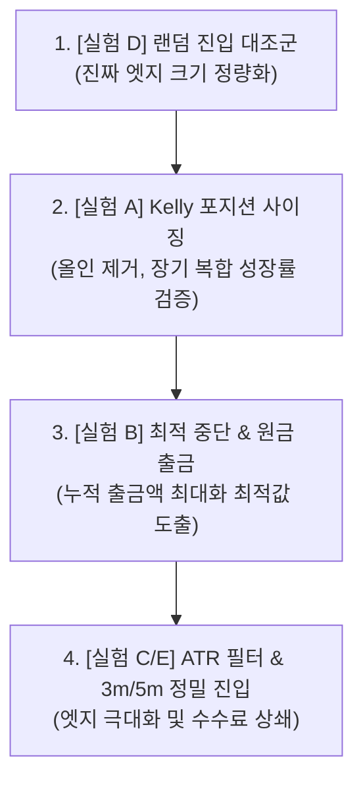

# 🔬 [전략 1] 이론적 한계 분석 및 정밀 개선 로드맵 (Theoretical Review & Proposals)

본 문서는 **[전략 1] 24h Rolling VWAP 2.0σ Climax Reversal**의 수학적·금융공학적 한계를 분석하고, 이미 학술적으로 증명된 '닫힌 문'과 여전히 데이터로 검증할 가치가 있는 '열린 개선 영역'을 체계적으로 정리한 연구 문서입니다.

---

## 📚 Part 1: 이미 답이 나온 영역 (Known Territory & Mathematical Certainty)

이 프로젝트가 다루는 문제—"고레버리지 소액 계좌로 초고승률 단기 반등을 반복 수확하면 돈을 벌 수 있는가?"—에 대해 수학과 금융공학이 이미 확립한 결론들입니다.

---

### 1. 도박꾼의 파멸 (Gambler's Ruin) — "무한히 돌리면 반드시 0원"

**핵심 정리:** 유한한 자본으로 무한히 반복 가능한 게임을 하면, 기대값이 양수이더라도 **매 거래에 전체 자본을 걸면(올인)** 파산 확률은 수학적으로 $1.0 (100\%)$입니다.

**현재 전략 1에의 적용:**
- 매 거래마다 계좌의 100%를 50배 레버리지로 투입 (= 올인)
- 1패 = 계좌의 100% 손실 (강제 청산)
- 승률이 $p = 0.927$이라 해도, $n$번째 거래까지 한 번도 지지 않을 확률은:

$$P(\text{생존}) = p^n = 0.927^n$$

| 거래 횟수 | 생존 확률 |
|:---|:---|
| 10회 | 46.8% |
| 20회 | 21.9% |
| 30회 | 10.2% |
| 50회 | 2.2% |
| 100회 | 0.05% |

> **결론:** 50배 올인 + 무손절 구조에서는 승률이 99%여도, 충분히 오래 돌리면 파산합니다. 이것은 논쟁의 여지가 없는 수학적 확실성입니다. **따라서 "승률을 더 올리는 것"은 이 구조를 근본적으로 바꾸지 못합니다.**

> ⚠️ **이미 닫힌 문:** "더 좋은 진입 시그널을 찾아서 승률을 93%에서 96%로 올리면 해결될까?" → **아닙니다.** 올인 구조에서는 승률 향상은 파산까지의 시간을 약간 늘릴 뿐, 파산 자체를 막을 수 없습니다.

---

### 2. 켈리 기준 (Kelly Criterion) — "한 번에 얼마를 걸어야 하는가"

**핵심 공식 (이산 버전):**

$$f^* = \frac{p \cdot b - q}{b}$$

여기서 $p$ = 승률, $q = 1 - p$ = 패율, $b$ = 순수익/순손실 비율 (odds)

**현재 전략 1의 Kelly 계산:**
- $p = 0.927$, $q = 0.073$
- 1승 시 수익: 계좌의 +10% → $b_{win} = 0.10$
- 1패 시 손실: 계좌의 -100% → $b_{loss} = 1.00$
- 따라서 odds $b = b_{win} / b_{loss} = 0.10$

$$f^* = \frac{0.927 \times 0.10 - 0.073}{0.10} = \frac{0.0927 - 0.073}{0.10} = \frac{0.0197}{0.10} = 0.197$$

> **Kelly가 말하는 최적 베팅 비율: 계좌의 약 19.7%**

현재 전략은 매 거래에 **100%**를 투입하고 있습니다. Kelly 최적값의 **5배 이상**을 베팅하고 있는 셈입니다. 이것은 "Over-Kelly"라고 불리며, 장기적으로 **음의 복합 성장률**을 만들어 **확실한 파산**으로 이끕니다.

> 💡 **핵심 통찰:** 전략의 문제는 진입 신호가 아니라 **포지션 사이징**입니다. 같은 전략이라도 투입 비율을 Kelly 이하(~20% 이하)로 낮추면 장기 생존이 수학적으로 가능해집니다.

---

### 3. 비대칭 청산 구조의 수학적 함정 — "승률 90%의 착시"

순수 랜덤워크(50:50 동전 던지기)에서도, +0.2% 먼저 닿으면 승리 / -1.6% 먼저 닿으면 패배라는 비대칭 구조를 적용하면 이론적 승률은:

$$p_{random} = \frac{1.6}{1.6 + 0.2} = \frac{1.6}{1.8} \approx 88.9\%$$

실측 승률 92.7%와 비교하면, **VWAP 클라이맥스 필터가 제공하는 진짜 엣지(True Edge)는 약 3.8%p**에 불과합니다.

> **이것이 의미하는 바:** 전략 1의 "92.7% 승률" 중 약 89%는 비대칭 구조가 만들어내는 수학적 착시이고, 전략 자체의 실질 기여는 ~4%p입니다.

---

### 4. 수수료의 레버리지 증폭 효과 — "보이지 않는 적"

50배 레버리지에서 수수료는 원금 기준이 아니라 **명목 거래대금(notional) 기준**으로 부과됩니다:

| 체결 방식 | 편도 수수료율 | 왕복 수수료 (명목대금 기준) | 50배 레버리지 시 계좌 대비 실부담 |
|:---|:---|:---|:---|
| 시장가 (Taker) | 0.05% | 0.10% | **계좌의 5.0%** |
| 지정가 (Maker) | 0.02% | 0.04% | **계좌의 2.0%** |

+0.2% 익절 시 계좌 총수익이 +10.0%인데, 시장가 체결이면 수수료만으로 5.0%가 나가므로 **순수익이 +5.0%로 반토막**입니다.

---

## 🧭 Part 2: 아직 실험 가치가 남아있는 영역 (Open Questions & Proposals)

위의 "닫힌 문"들을 인정한 위에서, **아직 데이터로 확인해볼 가치가 있는 개선 방향**들을 이론적 근거와 함께 제안합니다.

---

### 🥇 제안 A: Kelly 기반 포지션 사이징 (가장 높은 이론적 영향력)

**이론적 근거:** Kelly Criterion은 장기 복합 성장률을 최대화하는 유일한 수학적으로 증명된 베팅 전략입니다. 현재 전략의 가장 큰 문제가 "올인 구조"이므로, **같은 진입 신호를 유지하면서 투입 비율만 바꾸면** 결과가 극적으로 달라질 수 있습니다.

**구체적 실험 설계:**
- 현재: 계좌 100% 투입, 50배 레버리지 → 실효 레버리지 50배
- Kelly 최적: 계좌 ~20% 투입, 50배 레버리지 → 실효 레버리지 10배
- 보수적 Half-Kelly: 계좌 ~10% 투입, 50배 레버리지 → 실효 레버리지 5배

**기대 효과:**
- 1패 시 손실이 계좌의 100% → **10~20%**로 감소
- 파산 없이 손실 후 복구 가능
- 대신 1승 시 수익도 +10% → **+1~2%**로 감소
- **복리 효과가 장기적으로 작동하기 시작**

**핵심 질문:** "1승 수익이 줄어든 만큼 회전을 더 돌리면, 수수료 차감 후에도 순 복합 성장률이 양수를 유지할 수 있는가?"

---

### 🥈 제안 B: 최적 중단 (Optimal Stopping) + 원금 회수 룰

**이론적 근거:** 최적 중단 이론(Optimal Stopping Theory)은 "언제 그만둬야 기대값이 최대가 되는가?"에 대한 수학적 프레임워크입니다. 핵심 통찰은 **무한히 계속하는 것이 최적이 아니라는 점**입니다.

현재 전략의 구조적 문제는 "파산할 때까지 무한히 반복"한다는 것입니다. 하지만 만약 **특정 이정표에 도달하면 수익을 확정하고 리셋**하는 규칙을 도입하면, Gambler's Ruin의 전제 자체를 바꿀 수 있습니다.

**구체적 실험 설계:**
1. **"라운드" 개념 도입:** 초기 자본 $1,000으로 시작 → 목표 달성(예: $1,400) 시 $400 출금 후 $1,000으로 리셋
2. **다양한 출금 임계값 비교:** +20%, +40%, +60%, +100% 달성 시 초과분 출금
3. **1,000회 몬테카를로로 "총 누적 출금액" 비교:** 어느 임계값에서 장기 기대 누적 수익이 최대인가?

**핵심 질문:** "파산 전에 꺼내는 돈의 누적합이, 무한히 돌렸을 때의 기대값(결국 0원)보다 유의미하게 큰 양수가 되는 지점이 존재하는가?"

---

### 🥉 제안 C: ATR 변동성 회피 필터 (Regime Filter)

**이론적 근거:** 최근 암호화폐 미시구조 연구에 따르면, VWAP 평균 회귀 전략은 **레인지(횡보) 장세에서는 강력하지만, 강한 추세 장세(뉴스/이벤트)에서는 체계적으로 실패**합니다. 이것은 "Regime Dependence"라고 불리며, 시장을 두 가지 상태(평균 회귀 유효 / 무효)로 나누어 유효한 상태에서만 진입하면 실질 엣지가 증가합니다.

**구체적 실험 설계:**
- ATR(14봉)이 최근 96봉 ATR 평균의 1.5~2.0배를 초과하면 진입 금지
- "블랙스완 빔" 시점에서의 진입을 사전 차단

**핵심 질문:** "변동성 필터로 걸러낸 거래들 중 패배 거래의 비율이 유의미하게 높은가? 즉, 필터가 '나쁜 거래'를 선택적으로 제거하는가, 아니면 좋은/나쁜 거래를 가리지 않고 줄이는가?"

---

### 🏅 제안 D: 랜덤 진입 대조군 (Null Hypothesis 검증)

**이론적 근거:** 과학적 실험의 기본은 대조군입니다. 현재 승률 92.7%가 전략의 엣지인지, 비대칭 구조의 수학적 필연인지를 **정량적으로 분리**해야 다음 단계의 방향이 명확해집니다.

**구체적 실험 설계:**
1. 6개월 데이터에서 **완전 랜덤한 시점에 진입** (VWAP/거래량/꼬리 조건 없음)
2. 동일한 +0.2% TP / -1.6% 강제 청산 구조 적용
3. 1,000회 반복하여 **랜덤 진입 승률** 측정
4. 전략 승률(92.7%)과의 차이 = **순수 전략 엣지**

**기대 결과 시나리오:**

| 랜덤 진입 승률 | 해석 | 다음 행동 |
|:---|:---|:---|
| ~89% | 전략 엣지 ~3.8%p (얇음) | 수수료 절감과 포지션 사이징이 더 중요 |
| ~85% | 전략 엣지 ~7.7%p (유의미) | 진입 필터 추가 개선에 투자할 가치 있음 |
| ~80% 이하 | 전략 엣지 >12%p (강력) | 이 전략의 진입 로직 자체가 가치 있음 |

---

### 🎖️ 제안 E: 3분봉/5분봉 정밀 타점 진입 (Sniper Entry)

**이론적 근거:** 암호화폐 시장의 15분 단위 평균 회귀 현상은 학술적으로도 확인되어 있습니다. 최근 연구에서 바이낸스 183개 페어 중 약 90%가 15분 시계에서 유의미한 방향성 반전을 보입니다. 이 반전의 메커니즘은 "공격적 테이커 주문 후 유동성 보상"으로 설명됩니다.

핵심은 **반전이 시작되는 정확한 시점에 가까이 진입할수록 실질 엣지가 커진다**는 것입니다.

**구체적 실험 설계:**
- 15분봉에서 VWAP $2\sigma$ 이탈 확인 (방향 필터)
- 3분봉 또는 5분봉에서 꼬리 반전 캔들 출현 시 진입 (타이밍 정밀화)
- 동일한 +0.2% TP 적용, 진입가 개선 효과 측정

**핵심 질문:** "멀티 타임프레임 진입 시 평균 진입가가 15분봉 마감 시가 대비 몇 bps 개선되는가? 그 개선분이 수수료 부담을 상쇄할 수 있는 수준인가?"

---

## 🗺️ Part 3: 추천 실험 실행 로드맵

