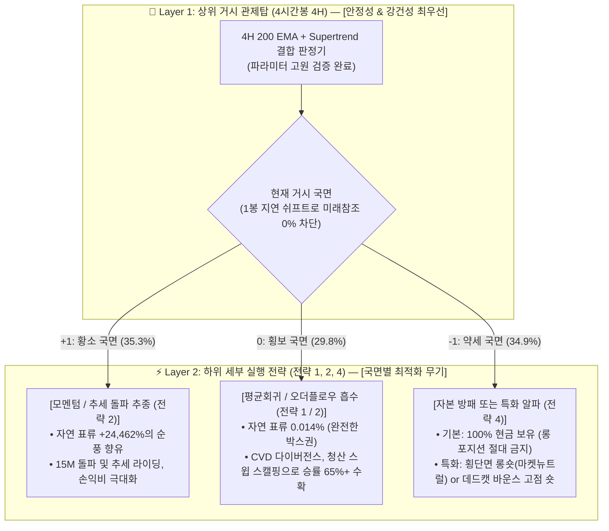

# 🧭 [전략 3] 4H 거시 국면 적응형 관제탑 기획서
## (STRAT-03: 4H Macro Regime-Adaptive Control Tower Charter)

* **전략 ID:** `STRAT-03-REGIME-ADAPTIVE`
* **전략 별칭:** 4H 거시 국면 적응형 관제탑 (Macro Control Tower)
* **버전:** `v1.0 (Validated & Architecture Finalized)`
* **최종 개정일:** 2026-09-05
* **상태:** ✅ **검증 및 프로덕션 모듈화 완료 (동결)**
* **핵심 실행 모듈:** [`experiments/strat03_regime/regime_control_tower.py`](../../experiments/strat03_regime/regime_control_tower.py)
* **상세 실험 및 검증 리포트:** [`docs/strat03_regime/experiment_results.md`](experiment_results.md)
* **마스터 로그북:** [`docs/strategies_logbook.md`](../strategies_logbook.md)

---

## 1. 연구 배경 및 문제 의식 (Why Regime Detection?)

### 1) 전략 1의 치명적 한계: '단 1패의 파산'
* **[전략 1] (VWAP 2.0σ Climax Reversal)**은 승률 92.7%라는 성과를 보였으나, **50배 고정 레버리지 구조**로 인해 단 1번의 원웨이 빔(강력한 추세 폭발)에 계좌가 전멸하는 문제를 내포하고 있습니다.
* 무조건적인 단기 방향 예측(Up vs Down)은 시장 노이즈로 인해 필연적으로 큰 손실을 야기합니다.

### 2) 핵심 전환점: "물리 법칙의 선택 (Regime Classification)"
* 금융 시장에서 가격의 1차 모멘트(단기 방향)는 예측이 어렵지만, **거시 추세와 변동성 구조는 강한 지속성(Continuity)과 군집성(Clustering)**을 가집니다.
* 따라서 **"어디로 갈까"**를 예측하기 전에, **"지금 어떤 물리 법칙이 지배하는 환경인가 (상승 순풍 vs 무방향 횡보 vs 파멸적 폭락)"**를 상위 관제탑에서 먼저 확정하고, 그에 맞춰 하위 전략과 노출도를 가변적으로 통제하는 아키텍처를 수립합니다.

---

## 2. 2대 계층 아키텍처 (Two-Tier Hierarchy Architecture)

본 시스템은 **[상위 거시 관제탑(4H)]**과 **[하위 세부 실행부(15M/5M)]**의 엄격한 역할 분담을 통해 동작합니다.

---

## 3. 관제탑 로직 및 검증 확정 요약

초기 연구 단계에서 탐색했던 복잡한 머신러닝(CatBoost, Random Forest, 3-Layer Meta-labeling)은 과적합 및 표본 외 붕괴(Fold 1 -48.4%)로 전량 폐기되었으며, **수학적·구조적으로 강건한 비모수적 결합 관제탑**으로 최종 확정되었습니다.

### 1) 관제탑 최종 수식
* **기준선 1:** 4시간봉 200 지수이동평균 ($\text{EMA}_{200}$)
* **기준선 2:** 4시간봉 Supertrend ($\text{ATR}=20, \text{Multiplier}=3.0$)
* **판정 규칙:**
  * **Regime +1 (황소):** $\text{Close} > \text{EMA}_{200} \text{ and } \text{Supertrend} == 1$
  * **Regime -1 (약세):** $\text{Close} < \text{EMA}_{200} \text{ and } \text{Supertrend} == -1$
  * **Regime  0 (횡보):** 두 지표 불일치 시 100% 현금/박스권 판정

### 2) 핵심 검증 지표 요약 (4.66개년 풀사이클)
* **7-Fold Walk-Forward OOS 검증:** 7개 중 6개 폴드 승리, 2022년 루나 폭락장(Fold 1) **+54.4% 생존 및 수익** (CatBoost는 -48.4% 파산).
* **파라미터 민감도 고원 (Robustness Plateau):** EMA(150~250) × Multiplier(2.5~3.5) 전수 9개 조합에서 **+86% ~ +167% 균일 수익 (절벽 없음)**.
* **국면 분리 능력:**
  * Regime +1: 비트코인 자연 표류 **+24,462%** (상승 모멘텀 지배)
  * Regime  0: 비트코인 자연 표류 **+0.014% / 4H** (순수 횡보)
  * Regime -1: 비트코인 자연 표류 **-99.5%** (대폭락 완벽 회피)

---

## 4. 성과 평가 지표 및 거버넌스 기준 (Governance)

1. **미래 정보 오염 방지 (Strict No-Lookahead):**
   - 관제탑 신호는 4시간봉이 완전히 마감된 후 `shift(1)`을 적용하여 다음 봉 시가부터 하위 전략에 전달됩니다.
2. **독립 모듈성:**
   - 관제탑은 하위 전략의 레버리지나 타점에 관여하지 않으며, 오직 "현재 환경의 성격(+1, 0, -1)"만을 공급합니다.
3. **상태 동결 및 다음 개발 연계:**
   - 전략 3의 관제탑은 추가 튜닝 없이 현재 상태로 동결하며, 본 기획서와 [실험 결과 보고서](experiment_results.md)를 바탕으로 **차기 전략(전략 2: 횡보/상승 특화, 전략 4: 약세장 알파)** 개발로 전환합니다.
