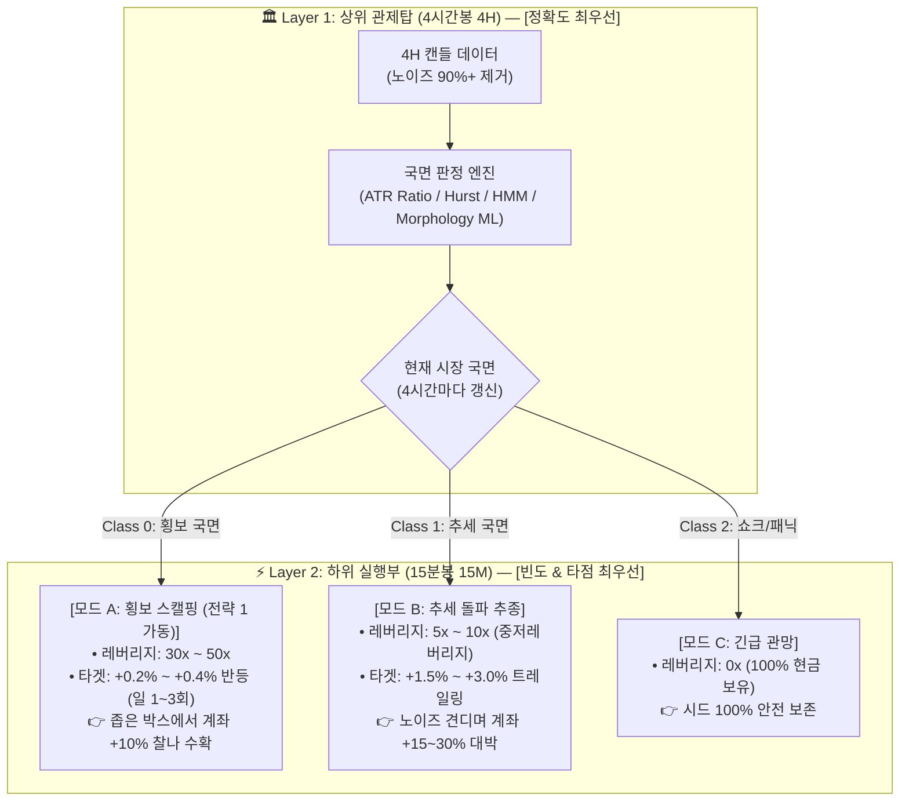
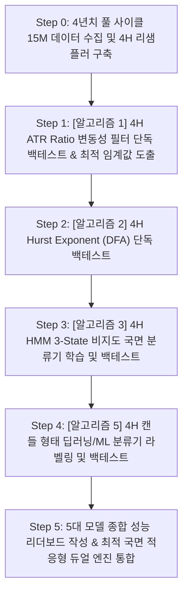

# 🧭 [전략 3] 4H 멀티 타임프레임 국면 적응형 듀얼 엔진 전략 기획서
## (STRAT-03: 4H Multi-Timeframe Regime-Adaptive Dual Engine)

* **전략 ID:** `STRAT-03-REGIME-ADAPTIVE`
* **전략 별칭:** 4H 멀티 타임프레임 국면 적응형 듀얼 엔진 전략
* **버전:** `v0.1 (Planning & Research Phase)`
* **최초 등록일:** 2026-09-01
* **관련 전략:** [`STRAT-01-VWAP-CLIMAX`](../strategies_logbook.md) (전략 1을 횡보 국면 서브 모듈로 계승)
* **마스터 로그북:** [`docs/strategies_logbook.md`](../strategies_logbook.md)

---

## 1. 연구 배경 및 문제 의식 (Why Regime Detection?)

### 1) 전략 1의 치명적 한계: '단 1패의 파산'
* **[전략 1] (VWAP 2.0σ Climax Reversal)**은 승률 92.7%라는 경이적인 성과를 보였으나, **50배 올인 고정 레버리지 구조**로 인해 단 1번의 원웨이 빔(강력한 추세 폭발)에 계좌가 전멸하는 **도박꾼의 파멸(Gambler's Ruin)** 문제를 내포하고 있습니다.
* 무조건적인 방향 예측(Up vs Down)은 효율적 시장 가설에 의해 50:50 동전 던지기로 수렴합니다.

### 2) 핵심 전환점: "물리 법칙의 선택 (Regime Classification)"
* 금융 시장에서 가격의 1차 모멘트(방향)는 예측이 불가능하지만, **2차 모멘트(변동성과 캔들의 형태)는 강한 군집성(Volatility Clustering)과 물리적 에너지 특성**을 가집니다.
* 따라서 **"어디로 갈까(방향)"**를 점치는 것이 아니라, **"지금 어떤 물리 법칙이 지배하는 환경인가(스프링 횡보 vs 관성 추세 vs 패닉 쇼크)"**를 먼저 판정하고, 그 환경에 맞춰 **전략과 레버리지를 가변적으로 전환(Dynamic Adaptation)**하는 것이 유일한 생존 및 복리 증식의 해법입니다.

---

## 2. 2대 계층 아키텍처 (Two-Tier Hierarchy Architecture)

본 전략은 **[상위 관제탑(4H)]**과 **[하위 실행부(15M)]**의 엄격한 역할 분담을 통해 **"정확도"**와 **"거래 빈도"**를 동시에 달성합니다.

---

## 3. 5대 독립 국면 판정 알고리즘 후보군 (Candidate Pool)

각 알고리즘은 독립된 엔진으로서 개별 검증(A/B 테스트) 후, 최적의 조합으로 2중 중첩(안전벨트 + 지능형 ML)할 수 있습니다.

| 번호 | 알고리즘 명칭 | 핵심 계산 및 판정 원리 | 난이도 / 장점 |
|:---:|:---|:---|:---:|
| **1** | **변동성 비율 모델** (ATR Ratio & Vol Z-Score) | $\text{ATR Ratio} = \frac{\text{단기 ATR}(14)}{\text{장기 ATR}(96)}$ • $\le 1.3$: 횡보 모드 • $> 1.5$: 변동성 폭발 경고 (역추세 차단) | **최하** 실시간 연산, 파산 빔 방어율 1위 |
| **2** | **허스트 지수 모델** (Hurst Exponent - DFA) | 4H 캔들 대상 DFA(Detrended Fluctuation Analysis) • $H < 0.45$: 강한 평균회귀 국면 • $H > 0.55$: 강한 추세 국면 | **중** 평균회귀 성향을 단일 수치화 |
| **3** | **은닉 마르코프 모델** (HMM 3-State) | [수익률, 변동성, 거래량] 입력 기반 비지도 학습 • State 0(횡보), State 1(추세), State 2(패닉) • 상태 전이 확률을 통한 동적 베팅 연동 | **중상** 학술적으로 검증된 샤프 지수 개선 효과 |
| **4** | **오더플로우 불균형** (CVD / OFI / 펀딩비) | 실시간 누적 볼륨 델타(CVD) 및 미체결약정(OI) 추적 • 대규모 연쇄 청산(Cascade) 실시간 감지 | **상** 초단기 미시구조 빔 사전 포착 |
| **5** | **상위봉 형태 딥러닝 분류기** (Morphology Classifier) | 하위 텐서 패턴 $\rightarrow$ 다음 4H 봉 형태 예측 • Class 0 (도지: $|C-O| < 0.6 \text{ATR}$) • Class 1 (장대봉: $|C-O| > 1.5 \text{ATR}$) • Class 2 (핀바: $\text{Wick} > 2.0 \times \text{Body}$) | **상** 다주기 비선형 패턴 직접 학습 |

---

## 4. 기준 데이터셋 정의 (Benchmark Dataset)

* **대상 자산:** 바이낸스 USDT-M 무기한 선물 `BTCUSDT`
* **기본 수집 타임프레임:** **15분봉 (`15m`)** (4H 캔들은 15m $\times 16$개 자동 리샘플링)
* **테스트 기간:** **2022년 01월 01일 ~ 현재 (약 4년+ 풀 사이클)**
* **데이터 규모:**
  * 15분봉: 약 **140,000개 캔들** (약 12MB CSV)
  * 4시간봉: 약 **8,760개 캔들**
  * 예상 거래 횟수: 약 **2,000회 이상**
* **선정 사유:** 
  * 2022년 (루나/FTX 대폭락 & 극단적 패닉장: 파산 방어력 검증)
  * 2023년 (크립토 윈터 장기 박스권: 50배 횡보 스캘핑 수익성 검증)
  * 2024~2026년 (ETF 승인 및 대세 상승장: 10배 추세 추종 전환 모드 검증)

---

## 5. 순차적 연구 및 검증 로드맵 (Execution Roadmap)

---

## 6. 성과 평가 지표 (Evaluation Metrics)

단순 정확도(Accuracy)의 착시를 배제하고 다음 **5대 정량 지표**로 평가합니다:

1. **소수 클래스(추세/빔) 재현율 (Recall on Trend/Shock):**  
   파멸적 빔 구간을 사전에 얼마나 높은 확률(목표 $80\%+$)로 회피/경고했는가?
2. **파산 회피율 및 계좌 생존율 (Survival Rate):**  
   50배 레버리지 환경에서 2022년 FTX 빔을 포함한 4년을 파산 없이 완주하는가?
3. **국면 조건부 승률 (Regime-Conditioned Win Rate):**  
   Class 0(횡보) 허가 구간에서 전략 1의 승률이 95%+를 유지하는가?
4. **동적 레버리지 누적 성장률 및 샤프 지수 (Sharpe Ratio):**  
   횡보(50x) + 추세(10x) 결합 시 연간 샤프 지수가 2.0 이상을 달성하는가?
5. **거래 빈도 유지도 (Trade Frequency):**  
   필터링 후에도 일평균 1.0 ~ 2.5회의 실전 거래 빈도가 확보되는가?

