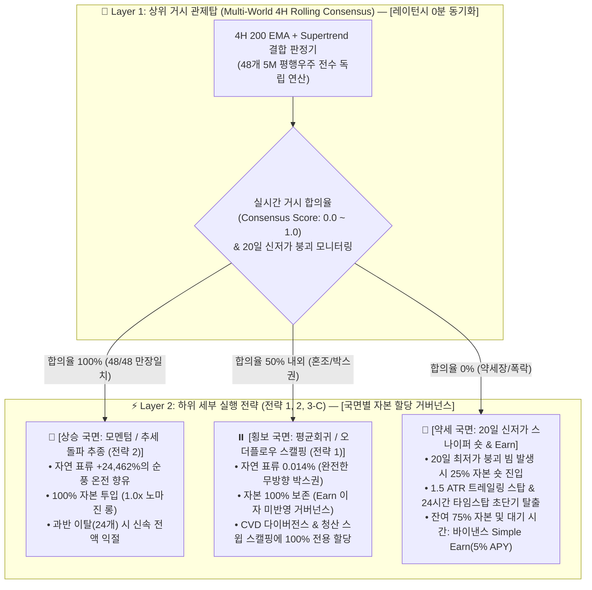

# 🧭 [전략 3] 4H 거시 국면 적응형 관제탑 및 약세장 스나이퍼 기획서
## (STRAT-03: 4H Macro Regime Control Tower & Breakdown Sniper Charter)

* **전략 ID:** `STRAT-03-REGIME-ADAPTIVE`
* **전략 별칭:** 4H 거시 국면 적응형 관제탑 & 약세장 스나이퍼 (Macro Control Tower & Bear Sniper)
* **버전:** `v1.2 (Hybrid Multi-World Consensus & Breakdown Sniper)`
* **최종 개정일:** 2026-09-06
* **상태:** ✅ **다중 월드 앙상블 & 약세장 스나이퍼 통합 확정 및 동결 (Freeze)**
* **핵심 실행 모듈:** [`experiments/strat03_regime/regime_control_tower.py`](../../experiments/strat03_regime/regime_control_tower.py)
* **상세 실험 및 검증 리포트:** [`docs/strat03_regime/experiment_results.md`](experiment_results.md)
* **약세장 대안 1단계 실측 리포트:** [`results/reports/strat03_bear_regime_step1_report.md`](../../results/reports/strat03_bear_regime_step1_report.md)
* **마스터 로그북:** [`docs/strategies_logbook.md`](../strategies_logbook.md)

---

## 1. 연구 배경 및 문제 의식 (Why Regime Detection & Bear Sniper?)

### 1) 전략 1의 치명적 한계: '단 1패의 파산'
* **[전략 1] (VWAP 2.0σ Climax Reversal)**은 승률 92.7%라는 성과를 보였으나, **50배 고정 레버리지 구조**로 인해 단 1번의 원웨이 빔(강력한 추세 폭발)에 계좌가 전멸하는 문제를 내포하고 있습니다.
* 무조건적인 단기 방향 예측(Up vs Down)은 시장 노이즈로 인해 필연적으로 큰 손실을 야기합니다.

### 2) 핵심 전환점: "물리 법칙의 선택 (Regime Classification)"
* 금융 시장에서 가격의 1차 모멘트(단기 방향)는 예측이 어렵지만, **거시 추세와 변동성 구조는 강한 지속성(Continuity)과 군집성(Clustering)**을 가집니다.
* 따라서 **"어디로 갈까"**를 예측하기 전에, **"지금 어떤 물리 법칙이 지배하는 환경인가 (상승 순풍 vs 무방향 횡보 vs 파멸적 폭락)"**를 상위 관제탑에서 먼저 확정하고, 그에 맞춰 하위 전략과 노출도를 가변적으로 통제하는 아키텍처를 수립합니다.

### 3) 시간 격자 편향(Grid Bias)의 극복: "다중 월드 롤링 앙상블 (Multi-World Consensus)"
* 기존 4시간봉(00:00, 04:00...)은 거래소 관습에 얽매여 최대 3시간 55분의 **신호 지연(Latency)**이 발생하고, 하위 전략(15M/5M)과의 통신 엇박자를 유발했습니다.
* 이에 4시간을 15분(16개) 또는 5분(48개) 단위로 분해한 **다중 평행 우주(Multi-World)**를 구축하여, **지표 수식은 100% 보존하면서 하위 전략과 1:1로 실시간 동기화되는 레이턴시 0분 관제탑**을 완성했습니다.

### 4) v1.2 추가: 약세 국면(Regime -1)의 자본 효율성 혁신
* 시장의 30.6%에 달하는 약세 국면 동안 단순 100% 현금 관망에 머무르지 않고, **"20일 신저가 붕괴 찰나 스나이퍼 숏 (0.25x 비중 + 1.5 ATR 트레일링) + 약세장 유휴 자본 연 5% Earn"**을 결합하여, **하락장에서도 MDD를 압축하면서 계좌를 우상향시키는 하이브리드 엔진**을 완성했습니다.

---

## 2. 3대 국면 거버넌스 및 실행 아키텍처 (Architecture v1.2)

본 시스템은 **[상위 거시 관제탑(4H 다중월드)]**과 **[하위 세부 실행부(15M/5M)]**의 실시간 동기화를 통해 동작하며, 횡보장 자본은 차기 전략 1을 위해 엄격히 보존합니다.

---

## 3. 관제탑 수식 및 실행 규칙 (Frozen Logic)

### 1) 관제탑 최종 수식
* **추세 기준선:** 4시간봉 200 지수이동평균 ($\text{EMA}_{200}$)
* **변동성 기준선:** 4시간봉 Supertrend ($\text{ATR}=20, \text{Multiplier}=3.0$)
* **약세장 신저가 기준선:** 4시간봉 직전 20일 최저가 ($\text{Donchian Low}_{120\text{ bars}}$), 완성봉 기준 `shift=1` (Lookahead 0%)
* **변동성 추적선:** 4시간봉 20주기 $\text{ATR}_{20}$

### 2) 다중 월드 앙상블 및 국면 규칙 (5분 단위 48개 평행 우주)
* **World $k$ 판정:** 각 우주의 4H 캔들이 마감되는 시점에 독립 판정 ($Close > EMA_{200} \text{ and } ST == 1$).
* **실시간 합의율:** $Consensus = \frac{\sum_{k=1}^{48} \text{Long}_k}{48}$
* **국면별 실행:**
  1. **Regime +1 (황소 국면):** 만장일치 ($Consensus == 1.0$) ➔ 롱 1.0x 진입 / 과반 이탈($\le 0.5$) ➔ 롱 전액 청산.
  2. **Regime  0 (횡보 국면):** 비포지션 100% 현금 보존 (차기 전략 1 가동 대기, 이자 0%).
  3. **Regime -1 (약세 국면):** 
     - **스나이퍼 숏 진입:** 관제탑 약세($ShortVotes \ge 24$) 상태에서 5M 종가가 직전 20일 최저가를 하향 돌파 시 즉시 자본의 25%(0.25x) 숏 진입.
     - **스나이퍼 숏 청산:** 1.5 ATR Trailing Stop 상향 돌파 시 익절/손절, 또는 24시간(48봉) 타임스탑 발동 시 즉시 탈출.
     - **약세장 유휴 현금:** 미투입 자본(75%) 및 대기 시간 동안 바이낸스 Simple Earn(연 5% APY) 일할 복리 적립.

---

## 4. 최종 확정 검증 성과표 (4.66개년 풀사이클 실측)

* **검증 기간:** 2022-01-01 ~ 2026-09-01 (492,059개 5분봉)
* **수수료 조건:** 바이낸스 무기한 선물 테이커 0.05% 양방향 (왕복 0.10% 실거래 차감)

| 전략 버전 | 4.66년 총수익률 | 연복리 (CAGR) | 최대낙폭 (MDD) | 샤프지수 | 총거래수 | 승률 | 비고 |
| :--- | :---: | :---: | :---: | :---: | :---: | :---: | :--- |
| **Baseline (v1.1 롱만 운용 + 100% 현금)** | **+176.4%** | 24.28% | -19.31% | 0.76 | 100회 | 32.0% | 기존 v1.1 기준선 |
| **Pure 3-C (v1.2 무이자 순수 매매)** | **+257.9% 🚀** | **31.33%** | **-18.78% 🛡️** | **0.91** | **224회** | **44.6% 👑** | **이자 0% 순수 숏 알파만으로 +81.5%p 도약** |
| **Final 확정안 (v1.2 횡보 제외 약세장 Earn)** | **+286.5% 👑** | **33.51% 👑** | **-18.63% 🛡️** | **0.95 👑** | **224회** | **44.6% 👑** | **[프로덕션 확정 사양]** |

### 위기 방어력 및 시장 구간별 안정성
* **2022년 루나/FTX 대폭락장 (BTC -65.2% 폭락 구간):** 
  - Baseline: -11.6% 손실 (MDD -19.31%)
  - **v1.2 확정안:** **+3.3% 흑자 완주**, **2022년 MDD 단 -13.13% 🛡️** (역대 최저 리스크 방어)
* **2023~2026년 정상/ETF/불장 구간 (루나/FTX 제외 최근 3.66년):**
  - Baseline: +212.7%
  - **v1.2 확정안:** **+279.8% ~ +302.7% 🚀** (숏 승률 **53.8%**, 숏 단독 누적수익 **+15.2%**, 숏 MDD 단 **-1.5%**)

---

## 5. 거버넌스 및 차기 개발 연계

1. **상태 동결 (Frozen):**
   - 전략 3은 본 **v1.2 (Hybrid Macro Control Tower & Breakdown Sniper)** 상태로 공식 동결합니다.
2. **차기 전략 1과의 시너지 개발 전환:**
   - 횡보 국면(Regime 0, 35.9%의 시간)의 100% 보존된 자본을 활용하여, 비트코인 무방향 박스권에서 승률 65%+를 수확할 **[전략 1: 15M CVD 흡수 다이버전스 & 청산 스윕 스캘핑]** 개발로 본격 전환합니다.
3. **전체 시스템 통합 시 스마트 캐시 매니지먼트 재검토 백로그:**
   - 상승 국면 선물 2.0x 레버리지 증거금 50% 분할 운용(+17.3%p 알파) 및 조기 가격 손절 시 유휴 자금 Simple Earn 자동 예치 프로토콜을 시스템 통합 단계에서 최종 탑재하기로 확정 (참조: [`docs/other_ideas.md: 섹션 7`](../other_ideas.md#7--전체-전략-통합-시-필수-재검토-과제-스마트-캐시-매니지먼트-프로토콜-smart-cash-management)).

