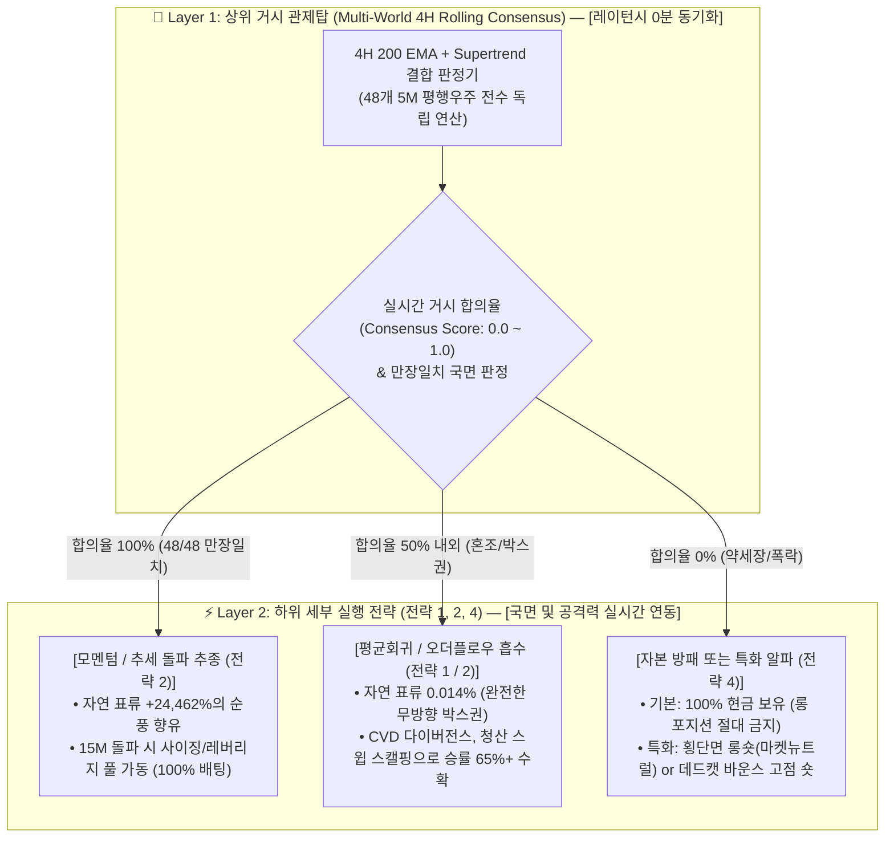

# 🧭 [전략 3] 4H 거시 국면 적응형 관제탑 기획서
## (STRAT-03: 4H Macro Regime-Adaptive Control Tower Charter)

* **전략 ID:** `STRAT-03-REGIME-ADAPTIVE`
* **전략 별칭:** 4H 거시 국면 적응형 관제탑 (Macro Control Tower)
* **버전:** `v1.1 (Multi-World Real-time Consensus Architecture)`
* **최종 개정일:** 2026-09-05
* **상태:** ✅ **다중 월드 실시간 동기화 아키텍처 확정 및 동결 (Freeze)**
* **핵심 실행 모듈:** [`experiments/strat03_regime/regime_control_tower.py`](../../experiments/strat03_regime/regime_control_tower.py)
* **상세 실험 및 검증 리포트:** [`docs/strat03_regime/experiment_results.md`](experiment_results.md)
* **마스터 로그북:** [`docs/strategies_logbook.md`](../strategies_logbook.md)

---

## 1. 연구 배경 및 문제 의식 (Why Regime Detection?)

### 1) 전략 1의 치명적 한계: '단 1패의 파산'
* **[전략 1] (VWAP 2.0σ Climax Reversal)**은 승률 92.7%라는 성과를 보였으나, **50배 고정 레버리지 구조**로 인해 단 1번의 원웨이 빔(강력한 추세 폭발)에 계좌가 전멸하는 문제를 내포하고 있습니다.
* 무조건적인 단기 방향 예측(Up vs Down)은 시장 노이즈로 인해 필연적으로 큰 손실을 야기합니다.

### 2) 핵심 전환점: "물리 법칙의 선택 (Regime Classification)"
* 금융 시장에서 가격의 1차 모멘트(단기 방향)는 예측이 어렵지만, **거시 추세와 변동성 구조는 강한 지속성(Continuity)과 군집성(Clustering)**을 가집니다.
* 따라서 **"어디로 갈까"**를 예측하기 전에, **"지금 어떤 물리 법칙이 지배하는 환경인가 (상승 순풍 vs 무방향 횡보 vs 파멸적 폭락)"**를 상위 관제탑에서 먼저 확정하고, 그에 맞춰 하위 전략과 노출도를 가변적으로 통제하는 아키텍처를 수립합니다.

### 3) 시간 격자 편향(Grid Bias)의 극복: "다중 월드 롤링 앙상블 (Multi-World Consensus)"
* 기존 4시간봉(00:00, 04:00...)은 거래소 관습에 얽매여 최대 3시간 55분의 **신호 지연(Latency)**이 발생하고, 하위 전략(15M/5M)과의 통신 엇박자를 유발했습니다.
* 이에 4시간을 15분(16개) 또는 5분(48개) 단위로 분해한 **다중 평행 우주(Multi-World)**를 구축하여, **지표 수식은 100% 보존하면서 하위 전략과 1:1로 실시간 동기화되는 레이턴시 0분 관제탑**을 완성했습니다.

---

## 2. 2대 계층 아키텍처 (Two-Tier Hierarchy Architecture)

본 시스템은 **[상위 거시 관제탑(4H 다중월드)]**과 **[하위 세부 실행부(15M/5M)]**의 실시간 동기화를 통해 동작합니다.

---

## 3. 관제탑 로직 및 검증 확정 요약

### 1) 관제탑 최종 수식 (비모수적 결합 관제탑)
* **기준선 1:** 4시간봉 200 지수이동평균 ($\text{EMA}_{200}$)
* **기준선 2:** 4시간봉 Supertrend ($\text{ATR}=20, \text{Multiplier}=3.0$)
* **다중 월드 앙상블 판정 규칙:**
  * **World $k$ 판정:** 각 우주의 4H 캔들이 마감되는 정확한 시점($T_{close}$)에 독립 판정 ($Close > EMA_{200} \text{ and } ST == 1$).
  * **실시간 합의율:** $Consensus = \frac{\sum_{k=1}^{N} \text{Long}_k}{N}$ ($N = 16 \text{ or } 48$)
  * **앙상블 국면:**
    * **Regime +1 (황소):** 만장일치 ($Consensus == 1.0$) ➔ 진입
    * **Regime  0 (횡보):** 합의 붕괴 ($Consensus \le 0.5$) ➔ 즉시 선제 탈출
    * **Regime -1 (약세):** 숏 만장일치 ➔ 현금 방패 유지

### 2) 핵심 검증 지표 요약 (4.66개년 풀사이클, 1.0x 노마진, 수수료 0.05% 양방향 차감)
* **48개 월드 앙상블 성과 (역대 최고 기록):**
  * **총수익률:** **+176.4%** (단독 4H Baseline +109.9% 대비 **+66.5%p 대폭 상승**)
  * **최대 낙폭 (MDD):** **-19.3%** (Baseline -23.6% 대비 리스크 완벽 압축)
  * **승률 (Win Rate):** **32.0%** (100회 거래 중 32승, 추세 추종 최상급 도달)
* **시간 해상도 수렴성 (Convergence):**
  * 해상도를 1단계(단독) ➔ 4단계(1시간) ➔ 16단계(15분) ➔ 48단계(5분)로 확장 시, **MDD가 -18%~-19%대에서 물리적으로 바닥 수렴**함을 입증.
* **미래 정보 오염 0% 보장:**
  * 모든 평행 우주는 마감된 완성봉 기준으로만 지표를 계산하고 해당 마감 시점에만 신호를 배포하여 Lookahead Bias 원천 차단.

---

## 4. 성과 평가 지표 및 거버넌스 기준 (Governance)

1. **미래 정보 오염 방지 (Strict No-Lookahead):**
   - 각 월드의 신호는 해당 4H 캔들이 완전히 마감된 시각($T_{close}$)에만 하위 전략으로 배포됩니다.
2. **실시간 인터페이스 규격 확정:**
   - 관제탑 모듈([`regime_control_tower.py`](../../experiments/strat03_regime/regime_control_tower.py))은 하위 전략(전략 1, 2, 4)에게 단순 정수 신호(+1, 0, -1)뿐 아니라, **실시간 0~100% 거시 합의도(`consensus_ratio`)**를 15M/5M 주기로 무지연(Zero-latency) 공급합니다.
3. **상태 동결 및 다음 개발 연계:**
   - 전략 3의 관제탑은 본 v1.1 다중 월드 아키텍처로 **최종 동결(Freeze)**하며, 본 관제탑 신호를 수신할 **차기 하위 세부 실행 전략(전략 2: 15M 돌파 및 트레일링, 전략 4: 약세장 알파)** 개발로 본격 전환합니다.

