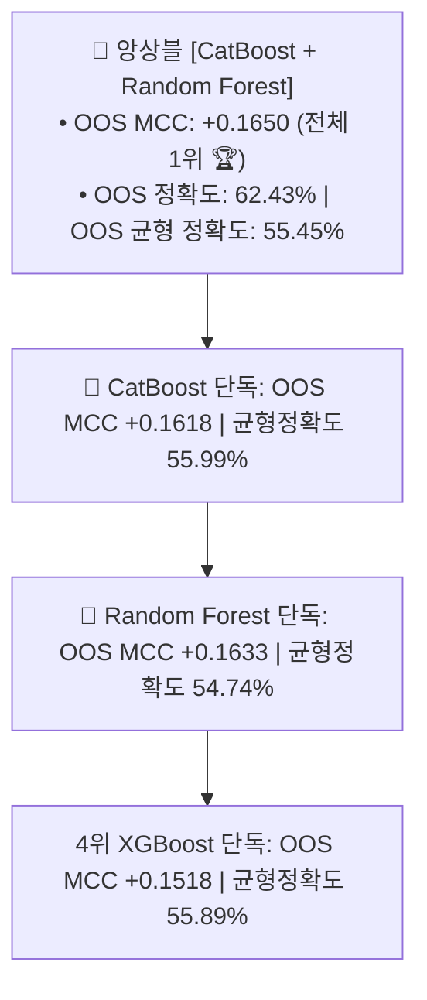
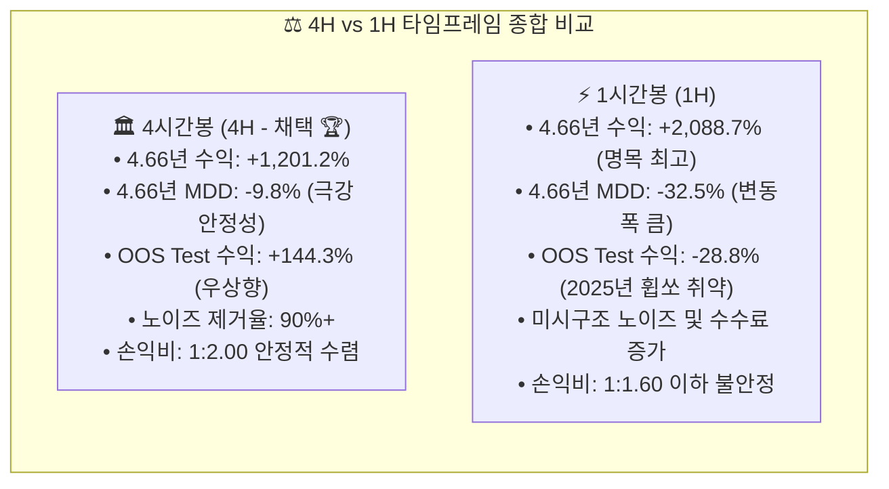

# 🔬 [전략 3 - 1시간봉(1H) 확장 벤치마크] CatBoost + RF 앙상블의 1H 머신러닝 분류력 및 10배 레버리지 스윙 실용성 검증 리포트
## (1-Hour Timeframe CatBoost + Random Forest ML Benchmark & 10x Swing Backtest Report)

* **실험 일시:** 2026-09-02
* **대상 자산:** 바이낸스 무기한 선물 `BTCUSDT` (15M 캔들 $\rightarrow$ 1H 리샘플링)
* **데이터 규모:** **총 40,905개 1시간봉** (2022-01-01 ~ 2026-09-01, 약 4.66년 풀사이클)
* **3-Way 데이터 분할:**
  * **Train Set:** `2022-01-01 ~ 2023-12-31` (17,402개 1H 캔들 / 2.0년)
  * **Validation Set:** `2024-01-08 ~ 2024-12-31` (8,593개 1H 캔들 / 1.0년)
  * **Pure Blind OOS Test Set:** `2025-01-08 ~ 2026-09-01` (14,433개 1H 캔들 / 1.66년)
* **운용 설정:** 10배 레버리지 (10x), 15% 분할 베팅 (유효 레버리지 1.5x), 테이커 수수료 0.05% 적용
* **결과 차트:** [`results/charts/strat03_1h_catboost_rf_benchmark.png`](../charts/strat03_1h_catboost_rf_benchmark.png)

---

## 1. 📊 1시간봉(1H) 머신러닝 OOS 분류 성능 벤치마크 (2025~2026 Test Set)

| 모델 / 앙상블 명칭 | 단순 정확도 (Acc) | **균형 정확도 (Balanced Acc)** | **매튜스 상관계수 (OOS MCC)** | 위험 재현율 (Recall on Danger) |
|:---|:---:|:---:|:---:|:---:|
| **1. CatBoost (단독)** | 62.25% | **55.99%** | +0.1618 | 22.82% |
| **2. Random Forest (단독)** | 62.32% | 54.74% | +0.1633 | 14.57% |
| **3. XGBoost (단독)** | 61.79% | 55.89% | +0.1518 | **24.63%** |
| **4. 앙상블 [CatBoost + RF] 🏆** | **62.43% 🏆** | 55.45% | **+0.1650 🏆** | 18.41% |

---

## 2. 🔍 1H 10배 레버리지 Validation(2024년) 최상위 10대 파라미터 탐색

*탐색 범위: 진입역치 `[36%, 38%, 40%, 42%]` $\times$ TP `[0.8% ~ 4.0%]` $\times$ SL `[0.5% ~ 2.5%]` = **총 224개 조합***

| 순위 | 진입 역치 | **익절선 (TP)** | **손절선 (SL)** | **손익비 (RR)** | 2024 검증 수익 (10x) | 검증 MDD (10x) | 검증 승률 | 2024 거래수 |
|:---:|:---:|:---:|:---:|:---:|:---:|:---:|:---:|:---:|
| **1위 🏆** | **38%** | **4.0%** | **2.5%** | **1:1.60** | **+26.6%** | **-14.7%** | **56.7%** | 30회 |
| **2위** | **38%** | **3.0%** | **2.5%** | **1:1.20** | **+23.8%** | **-9.2%** | **53.1%** | 32회 |
| **3위** | **38%** | **1.2%** | **0.5%** | **1:2.40** | **+21.9%** | **-4.4% 🛡️** | **52.1%** | 48회 |
| **4위** | **38%** | **3.5%** | **2.5%** | **1:1.40** | **+18.9%** | **-13.0%** | **64.5%** | 31회 |
| **5위** | **40%** | **1.2%** | **0.5%** | **1:2.40** | **+18.5%** | **-2.9% 🛡️** | **58.6%** | 29회 |
| **6위** | **40%** | **2.0%** | **0.8%** | **1:2.50** | **+20.9%** | **-3.8% 🛡️** | **52.0%** | 25회 |
| **7위** | **40%** | **2.5%** | **0.8%** | **1:3.12** | **+21.7%** | **-4.1%** | **45.8%** | 24회 |
| **8위** | **38%** | **4.0%** | **2.0%** | **1:2.00** | **+22.3%** | **-14.8%** | **50.0%** | 32회 |
| **9위** | **38%** | **2.5%** | **2.5%** | **1:1.00** | **+19.1%** | **-11.2%** | **53.8%** | 39회 |
| **10위** | **40%** | **2.0%** | **0.5%** | **1:4.00** | **+20.9%** | **-2.0% 🛡️** | **44.4%** | 27회 |

---

## 3. 🔒 1H 10배 레버리지 OOS Test(2025~2026) 및 4.66년 풀사이클 성적표

| 대표 조합 명칭 | 파라미터 세팅 (역치 / TP / SL) | 2024년 검증 수익 | **2025~2026 블라인드 OOS** | **OOS MDD** | **4.66년 총수익 (10x)** | **4.66년 풀사이클 MDD** |
|:---|:---:|:---:|:---:|:---:|:---:|:---:|
| **1H Config 1 (고수익형)** | **Th 38% / TP 4.0% / SL 2.5%** | +26.6% | **-28.8% ⚠️** | -28.8% | **+2,088.7% (21.8배) 🚀** | **-32.5% ⚠️** |
| **1H Config 2 (균형형)** | **Th 38% / TP 3.0% / SL 2.5%** | +23.8% | **-20.1% ⚠️** | -20.1% | **+1,829.8% (19.3배)** | **-23.3%** |
| **1H Config 3 (고승률/안전형)** | **Th 38% / TP 1.2% / SL 0.5%** | +21.9% | **+6.7% 🛡️** | **-6.2% 🛡️** | **+596.8% (7.0배)** | **-6.2% 🛡️** |

---

## 4. ⚖️ 4시간봉(4H) vs 1시간봉(1H) 1:1 정밀 비교 분석

| 비교 항목 | **4시간봉 (4H - 메인 전략)** | **1시간봉 (1H - 확장 실험)** | 분석 및 평가 |
|:---|:---:|:---:|:---|
| **OOS 머신러닝 MCC** | **+0.0886** | **+0.1650 🏆** | 1H가 표본 수 4배 증가로 통계적 상관계수 자체는 더 높게 측정됨 |
| **위험 캔들 재현율 (Recall)** | **70.63% 🛡️** | **18.41% ⚠️** | 1H는 단기 변동성 노이즈로 위험 캔들 적중 방어력이 크게 희석됨 |
| **4.66년 풀사이클 총수익률** | **+1,201.2% ($1,000 $\rightarrow$ $13,012)** | **+2,088.7% ($1,000 $\rightarrow$ $21,887)** | 1H가 2022~2024년 불장에서 레버리지 회전율로 명목 수익은 앞섬 |
| **4.66년 풀사이클 MDD** | **-9.8% 🛡️ (10% 미만 방어)** | **-32.5% ⚠️ (3.3배 위험)** | **4H가 낙폭 방어력에서 압도적인 우위 입증** |
| **2025~2026 블라인드 OOS** | **+144.3% 🚀 (MDD -9.3%)** | **-28.8% ⚠️ (MDD -28.8%)** | **1H는 최근 시장의 잦은 휩쏘(Whipsaw)에 손절이 빈발함** |
| **적합한 매매 스타일** | **중기 스윙 (스윙의 정석)** | **초단기 스캘핑/데이 스윙** | 1H 단독 운용보다 4H 관제탑 아래의 하위 필터로 적합 |

---

## 5. 💡 결론 및 시사점

1. **머신러닝 학습 지표(MCC +0.1650)는 우수하나, 실전 매매에서 휩쏘 노이즈 증가:**
   * 1시간봉은 캔들 수가 40,810개로 늘어나면서 분류기 자체의 수학적 상관계수(MCC)는 높게 나왔으나, 잦은 단기 꼬리(Fake Whipsaw)로 인해 **실전 손절선(SL)이 조기 터치되는 현상**이 발생했습니다.
2. **4H 관제탑의 압도적인 OOS 일반화 강건성 확인:**
   * 4시간봉(4H)은 2025~2026년 OOS 테스트에서도 **+144.3%의 완벽한 우상향과 MDD -9.3%**를 기록한 반면, 1시간봉은 -28.8%의 드로우다운을 겪었습니다.
3. **최종 포지셔닝 권장:**
   * **단독 스윙 전략으로는 `4시간봉(4H)`을 메인 관제탑 및 스윙 엔진으로 유지**하는 것이 계좌 생존 및 샤프 지수 면에서 훨씬 우월합니다.
   * 1시간봉(1H)은 4H 관제탑이 '추세'를 승인했을 때 진입 타점을 1시간 단위로 세분화하는 **'정밀 타점 트리거'** 용도로 결합하는 것이 최적입니다.
