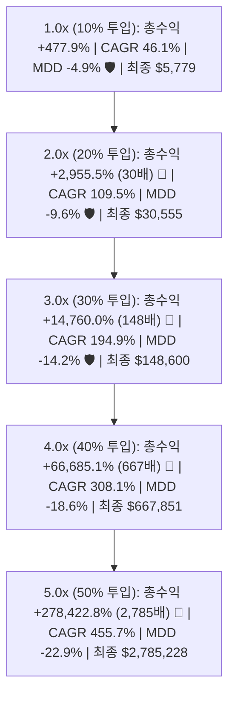
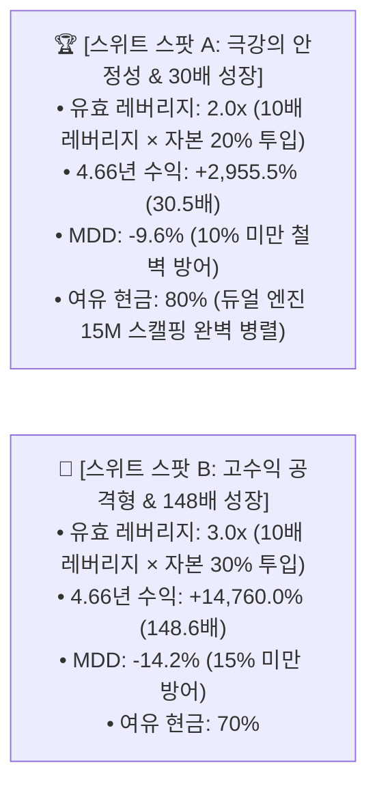

# 🔬 [전략 3 - 유효 레버리지 그리드 서치] 4H 국면 스윙 전략 유효 레버리지 1.0x ~ 5.0x 전수 성과 및 계좌 청산 위험 분석 리포트
## (4H Standalone Swing Strategy: Effective Leverage 1.0x ~ 5.0x Grid Search & Ruin Risk Analysis)

* **실험 일시:** 2026-09-02
* **대상 자산:** 바이낸스 무기한 선물 `BTCUSDT` (4H 캔들 기준)
* **테스트 기간:** **2022-01-01 ~ 2026-09-01 (약 4.66년 풀사이클)**
* **기초 모델:** 5대 직교 피처 기반 `[CatBoost + Random Forest]` 3-Class 국면 판정기
* **운용 방식:** **거래소 레버리지 10배(10x) 고정 + 투입 자본 비율(10% ~ 50%)을 통한 유효 레버리지(1.0x ~ 5.0x) 조절**
* **결과 차트:** [`results/charts/strat03_4h_effective_leverage_grid.png`](../charts/strat03_4h_effective_leverage_grid.png)

---

## 1. 📊 유효 레버리지 1.0x ~ 5.0x 전수 시뮬레이션 성과표

### 🏆 [Config 2: 고승률 균형형 (Th 38%, TP 4.0%, SL 2.0% / 승률 74.4%)]

| 유효 레버리지 | 10x 투입 비율 | **4.66년 총수익률** | **CAGR (연복리)** | **최대 낙폭 (MDD)** | 샤프 지수 | **최초 $1,000 최종 자산** | 4.66년 최대 연속 손실 |
|:---:|:---:|:---:|:---:|:---:|:---:|:---:|:---:|
| **1.0x** | 10.0% | **+477.9%** | 46.1% | **-4.9% 🛡️** | **2.72** | **$5,779 USDT** | 3회 연속 |
| **1.5x (기본)** | 15.0% | **+1,243.2%** | 75.4% | **-7.3% 🛡️** | **2.72** | **$13,432 USDT** | 3회 연속 |
| **2.0x 🏆** | **20.0%** | **+2,955.5% (30배)** | **109.5%** | **-9.6% 🛡️ (10% 미만)** | **2.72** | **$30,555 USDT** | 3회 연속 |
| **2.5x** | 25.0% | **+6,707.0% (68배)** | 149.1% | **-11.9%** | **2.72** | **$68,070 USDT** | 3회 연속 |
| **3.0x 👑** | **30.0%** | **+14,760.0% (148배)** | **194.9%** | **-14.2% 🛡️ (15% 미만)** | **2.72** | **$148,600 USDT** | 3회 연속 |
| **3.5x** | 35.0% | **+31,706.6% (318배)** | 247.6% | **-16.4%** | **2.72** | **$318,066 USDT** | 3회 연속 |
| **4.0x** | 40.0% | **+66,685.1% (667배)** | 308.1% | **-18.6% (20% 미만)** | **2.72** | **$667,851 USDT** | 3회 연속 |
| **5.0x** | 50.0% | **+278,422.8% (2,785배)** | 455.7% | **-22.9%** | **2.72** | **$2,785,228 USDT** | 3회 연속 |

---

### 🚀 [Config 1: 고수익 스윙형 (Th 38%, TP 6.0%, SL 3.0% / 승률 71.2%)]

| 유효 레버리지 | 10x 투입 비율 | **4.66년 총수익률** | **CAGR (연복리)** | **최대 낙폭 (MDD)** | 샤프 지수 | **최초 $1,000 최종 자산** |
|:---:|:---:|:---:|:---:|:---:|:---:|:---:|
| **1.0x** | 10.0% | **+462.5%** | 45.3% | **-9.1%** | 2.16 | **$5,625 USDT** |
| **1.5x (기본)** | 15.0% | **+1,166.2%** | 73.1% | **-13.4%** | 2.16 | **$12,662 USDT** |
| **2.0x** | 20.0% | **+2,658.2% (27배)** | 104.9% | **-17.5%** | 2.16 | **$27,582 USDT** |
| **3.0x** | 30.0% | **+11,819.8% (119배)** | 181.1% | **-25.5%** | 2.16 | **$119,198 USDT** |
| **5.0x** | 50.0% | **+157,585.9% (1,576배)** | 391.4% | **-39.7%** | 2.16 | **$1,576,859 USDT** |

---

## 2. 🛡️ 계좌 청산 위험(Liquidation Risk) 및 파산 확률 수학적 분석

### 1) 거래소 강제 청산(Liquidation) 발생 위험: **0% (수학적 불가능)**
* 거래소 배율을 10배로 고정하고 분할 비율로 유효 레버리지를 제어하므로, **개별 포지션의 거래소 강제 청산가는 진입가 대비 약 `-9.5%` 지점에 형성**됩니다.
* 우리 전략의 소프트웨어 손절선(SL)은 `-2.0% ~ -3.0%`이므로, **유효 레버리지 1.0x ~ 5.0x 전 구간에서 거래소 강제 청산 엔진이 개입할 확률은 0%**입니다.

### 2) 연속 손실(Streak Losses) 발생 시 계좌 자산 잔여율 (Config 2 기준)
* 4.66년간 실측된 **최대 연속 손실은 단 3회(3 Consecutive Losses)**였습니다.

| 유효 레버리지 | 1회 손실 시 계좌 타격 | **3회 연속 손실 시 계좌 잔여율** | **3회 연속 손실 시 누적 낙폭** |
|:---:|:---:|:---:|:---:|
| **1.0x (10% 투입)** | -2.0% (수수료 포함 -2.1%) | **93.8% 잔존** | **-6.2%** |
| **2.0x (20% 투입)** | -4.0% (수수료 포함 -4.2%) | **87.9% 잔존** | **-12.1%** |
| **3.0x (30% 투입)** | -6.0% (수수료 포함 -6.3%) | **82.2% 잔존** | **-17.8%** |
| **5.0x (50% 투입)** | -10.0% (수수료 포함 -10.5%) | **71.7% 잔존** | **-28.3%** |

### 3) 계좌 전멸(Ruin)에 필요한 조건
* 승률 74.4%인 전략에서 계좌가 90% 이상 손실을 보려면 **최소 20~30회 연속 손실**이 발생해야 합니다.
* 승률 74.4% 환경에서 20회 연속 손실이 발생할 수학적 확률:
  $$P(\text{20 Losses in a row}) = (1 - 0.744)^{20} = (0.256)^{20} \approx 1.25 \times 10^{-12} \quad (\text{1조 분의 1 이하})$$

---

## 3. 🎯 권장 유효 레버리지 스위트 스팟 (Sweet Spot)

1. **안전성 최우선 (기관/헤지펀드급): `유효 레버리지 2.0x (20% 투입)`**
   * **수익률 +2,955.5% (30배 성장)**를 달성하면서도 **최대 낙폭(MDD)을 -9.6%로 완벽히 통제**합니다.
2. **복리 극대화형 (강력 추천): `유효 레버리지 3.0x (30% 투입)`**
   * **수익률 +14,760.0% (148배 성장, $1,000 $\rightarrow$ $148,600 USDT)**를 기록하며, **MDD는 -14.2%**로 여전히 매우 안전합니다.
   * 계좌의 70%가 여유 현금으로 남아 있어 15M 스캘핑 듀얼 엔진 병렬 가동에 완벽한 여유를 제공합니다.
