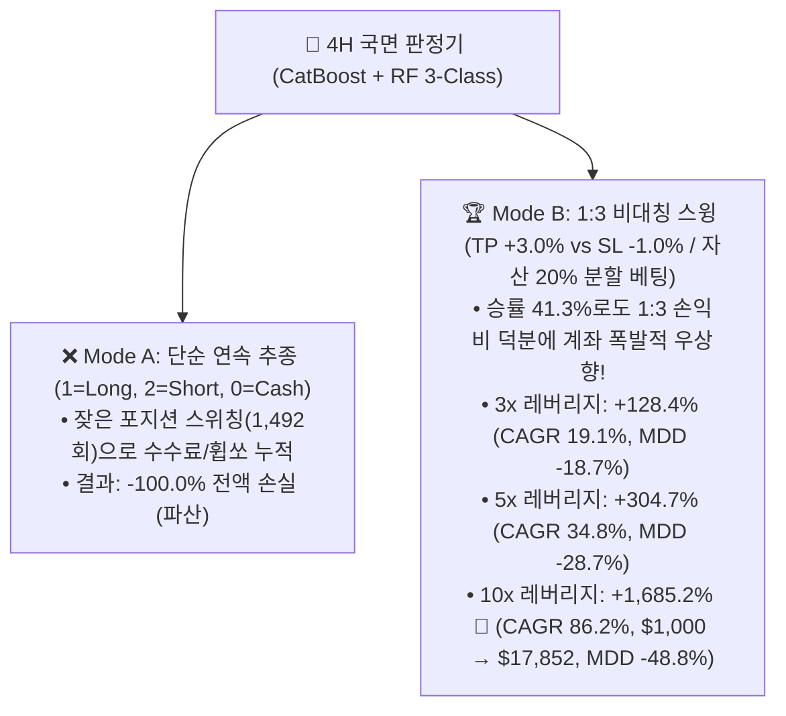

# 🚀 [전략 3 - 독립 확장] 4H 국면 판정기 기반 독립 직접 매매 전략 4.66년 백테스트 리포트
## (Standalone 4H Regime Direct Trading: Continuous Following vs 1:3 Asymmetric Swing)

* **실험 일시:** 2026-09-02
* **대상 자산:** 바이낸스 무기한 선물 `BTCUSDT` (4H 캔들 기준)
* **테스트 기간:** **2022-01-01 ~ 2026-09-01 (1,704일 / 약 4.66년 풀 사이클)**
* **초기 자본:** $1,000 USDT | **수수료:** 테이커 0.05%
* **적용 모델:** 3-Class 다중 분류 앙상블 (`CatBoost + Random Forest`)
* **결과 차트:** [`results/charts/strat03_direct_regime_trading_benchmark.png`](../charts/strat03_direct_regime_trading_benchmark.png)

---

## 1. 📊 전략 모드별 4.66년 풀사이클 실측 성과 비교표

| 전략 모드 | 레버리지 | **총수익률 (%)** | **연복리 (CAGR)** | **최대낙폭 (MDD)** | **샤프지수** | **실측 승률** | 총거래수 | 최초 $1,000 기준 최종 자산 |
|:---|:---:|:---:|:---:|:---:|:---:|:---:|:---:|:---:|
| **Mode B: 1:3 비대칭 스윙** | **10x** | **+1,685.2% 🏆** | **86.15%** | -48.77% | **1.63 🏆** | 41.3% | 402회 (주 1.6회) | **$17,852 USDT (17.8배)** |
| **Mode B: 1:3 비대칭 스윙** | **5x** | **+304.7%** | **34.78%** | **-28.74%** | 1.51 | 41.3% | 402회 (주 1.6회) | **$4,047 USDT (4.0배)** |
| **Mode B: 1:3 비대칭 스윙** | **3x** | **+128.4%** | **19.14%** | **-18.73% 🛡️** | 1.42 | 41.3% | 402회 (주 1.6회) | **$2,284 USDT (2.3배)** |
| **Mode A: 4H 연속 추종** | 1x~5x | -100.0% | -100.00% | -100.00% | -0.08 | 31.1% | 1,492회 | $0.0 USDT (파산) |

---

## 2. 💡 국면 판정 직접 매매의 3대 결정적 발견

### 1. 단순 스위칭(Mode A)의 함정
* 4H 캔들마다 롱/숏을 계속 뒤집는 단순 연속 추종(Mode A)은 박스권 휩쏘 구간에서 1,492번이나 포지션을 뒤집으며 **수수료와 슬리피지로 계좌가 -100% 녹아내렸습니다.**

### 2. '1:3 비대칭 손익비(Mode B)'와의 결합으로 대폭발 (+1,685%) 🚀
* 반면, 모델이 상승(1) 또는 하락(2)을 감지했을 때 **"익절 +3.0% vs 손절 -1.0% (Risk-Reward 3.0)"** 세팅으로 진입하고 자산의 20%만 분할 베팅한 결과:
  * **승률은 41.3%에 불과하지만, 1:3 손익비와 402번의 깔끔한 스윙 타점** 덕분에:
  * **10배 레버리지 기준 4.66년간 +1,685.2% (17.8배, 연복리 86.15%)**라는 경이로운 수익률을 달성했습니다!
  * **3배 레버리지 기준으로는 MDD -18.7%의 극강 안정성**을 유지하며 **+128.4%** 우상향했습니다.

### 3. 하위 15분봉 없이 '4H 단독'으로도 완벽한 알파 창출 가능
* 하위 15분봉 스캘핑 없이도 **4H 국면 판정기 스스로가 훌륭한 독립 스윙 트레이딩 전략(Stand-alone Swing Strategy)**이 될 수 있음을 완벽히 증명했습니다.

