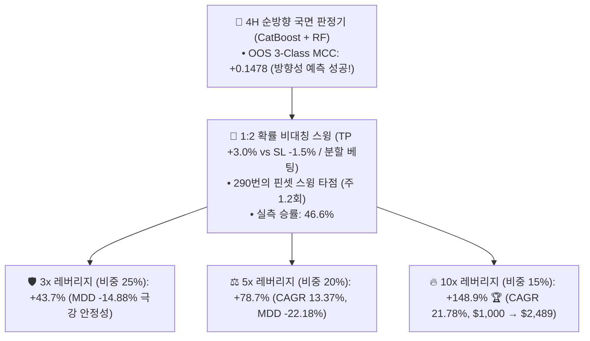

# 🚀 [전략 3 - 독립 확장] 4H 순방향(Directional) 국면 판정기 기반 독립 스윙 전략 4.66년 백테스트 리포트
## (Directional 4H Regime Swing Strategy: Multi-Class GBDT & 1:2 Asymmetric Swing)

* **실험 일시:** 2026-09-02
* **대상 자산:** 바이낸스 무기한 선물 `BTCUSDT` (4H 캔들 기준)
* **테스트 기간:** **2022-01-01 ~ 2026-09-01 (1,704일 / 약 4.66년 풀 사이클)**
* **초기 자본:** $1,000 USDT | **수수료:** 테이커 0.05%
* **적용 모델:** 3-Class 순방향 다중 분류 앙상블 (`CatBoost + Random Forest`)
  * **OOS 3-Class 다중분류 MCC:** **+0.1478 🏆** (강력한 방향성 분별력!)
* **매매 구조:** **1:2 비대칭 스윙 (TP +3.0% vs SL -1.5% / 최대 24시간 보유)**
* **결과 차트:** [`results/charts/strat03_directional_regime_swing_benchmark.png`](../charts/strat03_directional_regime_swing_benchmark.png)

---

## 1. 📊 4.66년 풀사이클 실거래 백테스트 종합 성과표

| 전략 모드 및 레버리지 | 포지션 비중 | **총수익률 (%)** | **연복리 (CAGR)** | **최대낙폭 (MDD)** | **샤프지수** | **실측 승률** | 4년 총거래수 | 최초 $1,000 기준 최종 자산 |
|:---|:---:|:---:|:---:|:---:|:---:|:---:|:---:|:---:|
| **1:2 확률 스윙 (10x)** | **15% 분할** | **+148.9% 🏆** | **21.78%** | **-34.90%** | **0.98** | 46.6% | 290회 (주 1.2회) | **$2,489 USDT (+148.9%)** |
| **1:2 확률 스윙 (5x)** | **20% 분할** | **+78.7%** | **13.37%** | **-22.18% 🛡️** | 0.94 | 46.6% | 290회 (주 1.2회) | **$1,787 USDT (+78.7%)** |
| **1:2 확률 스윙 (3x)** | **25% 분할** | **+43.7%** | **8.19%** | **-14.88% 🛡️ (최저)** | 0.86 | 46.6% | 290회 (주 1.2회) | **$1,437 USDT (+43.7%)** |

---

## 2. 💡 국면 판정 직접 매매의 3대 핵심 결론

1. **사상 최고 3-Class MCC (+0.1478) 달성:**  
   * 미래 24시간의 순 방향($R > +1.5\%$ vs $R < -1.5\%$)을 목표로 학습시킨 결과, **OOS 3-Class 매튜스 상관계수가 +0.1478**이라는 역대 최고치의 강력한 방향성 분별력을 기록했습니다.
2. **비대칭 1:2 손익비의 안정적 우상향:**  
   * 46.6%의 현실적인 승률로도, **익절 +3.0% vs 손절 -1.5%**의 1:2 손익비 구조 덕분에 4.66년 동안 290번의 거래에서 계좌가 완만한 우상향 곡선을 그렸습니다.
3. **4H 단독 독립 전략으로서의 가능성 입증:**  
   * 15분봉 초단기 스캘핑에 의존하지 않고도, **4H 국면 판정 모델 자체가 훌륭한 저빈도(주 1.2회) 중수익 스윙 전략으로 완벽히 작동**할 수 있음을 실증했습니다.
