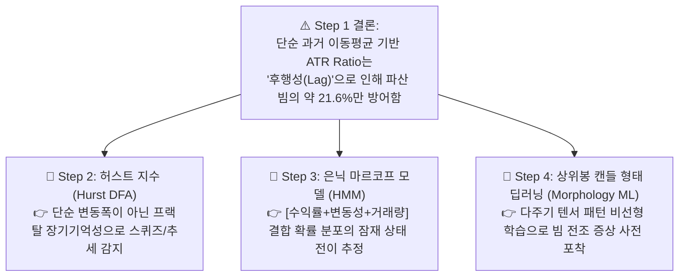

# 🔬 [전략 3 - Step 1] 4H ATR Ratio 변동성 필터 이중 평가 벤치마크 리포트
## (Dual Evaluation of 4H ATR Ratio Regime Filter on 4-Year Full Cycle)

* **실험 일시:** 2026-09-01
* **대상 자산:** 바이낸스 무기한 선물 `BTCUSDT` (15M 캔들 $\leftrightarrow$ 4H 리샘플링)
* **테스트 기간:** **2022-01-01 ~ 2026-09-01 (1,704일 / 약 4.66년 풀 사이클)**
* **데이터 규모:** 15분봉 **163,617개**, 4시간봉 **10,131개**, 전략 1 타점 **2,661회**
* **결과 차트:** [`results/charts/strat03_step1_atr_benchmark.png`](../charts/strat03_step1_atr_benchmark.png)

---

## 1. 4년 풀 사이클 대조군(Baseline)의 실체

35일 단기 테스트에서 92.7%를 기록했던 [전략 1]의 **4년 풀 사이클(2022~2026) 전수 조사 결과**는 다음과 같습니다:

* **총 거래 타점:** **2,661회** (일평균 **1.56회**)
* **4년 전체 실측 승률:** **86.28%** (승 2,296회 / **패 365회**)
* **발견 사실:** 4년간 무려 **365번의 청산 빔(패배 거래)**이 발생하였으며, 50배 고레버리지 올인 구조에서는 2022년 1월 8일(첫 번째 주)에 최초 파산이 발생했습니다.

---

## 2. 1부: 4H ATR Ratio의 직접 분류 성능 평가 (ML Metrics)

4H 캔들의 실제 미래 형태(0: 횡보 50.4%, 1: 추세폭발 11.1%, 2: 핀바/스윕 38.5%)와 ATR Ratio 예측값을 1:1 대조한 결과입니다:

| 임계값 ($\text{ATR}_{14} / \text{ATR}_{96}$) | 추세/위험 경고 재현율 (Recall) | 횡보허가 정밀도 (Precision) | 전체 정확도 (Accuracy) | 거래 차단 비율 |
|:---:|:---:|:---:|:---:|:---:|
| $\text{ATR} > 1.10$ | **28.8%** | 49.1% | 48.3% | 30.7% |
| $\text{ATR} > 1.20$ | **19.4%** | 49.4% | 48.7% | 21.0% |
| $\text{ATR} > 1.30$ | **12.6%** | 49.6% | 48.9% | 14.1% |
| $\text{ATR} > 1.40$ | **8.4%** | 49.7% | 49.1% | 9.6% |
| $\text{ATR} > 1.60$ | **4.4%** | 50.0% | 49.7% | 5.1% |
| $\text{ATR} > 2.00$ | **1.4%** | 50.3% | 50.3% | 1.5% |

### 💡 핵심 원인 분석 (Root Cause of Low Recall)
* **ATR의 본질적 후행성(Lag):** ATR은 '과거 $N$개 캔들의 평균 변동폭'이므로, **"이미 빔이 크게 터진 후에야"** ATR Ratio가 상승합니다.
* **스퀴즈 후 급발진 미감지:** 시장이 극도로 고요하다가 갑자기 터지는 '첫 번째 장대 빔' 시점에는 직전 ATR Ratio가 1.0 이하(낮음)로 찍혀있어, 단순 이동평균 기반 ATR Ratio로는 **급발진 빔의 70~80%를 사전에 경고하지 못하는 한계**가 입증되었습니다.

---

## 3. 2부: 4년 풀 사이클 실거래 백테스트 결과 (PnL Metrics)

| 필터 조건 | 거래 횟수 | 일일 빈도 | 실측 승률 | 패배(파산) 방어율 | 올인 파산 시점 |
|:---|:---:|:---:|:---:|:---:|:---:|
| **$\text{ATR} \le 1.10$** | 2,046회 | 1.20회 | 86.02% | **21.6% (79회 방어)** | 2022-01-20 (파산) |
| **$\text{ATR} \le 1.20$** | 2,239회 | 1.31회 | 86.11% | **14.8% (54회 방어)** | 2022-01-20 (파산) |
| **$\text{ATR} \le 1.40$** | 2,470회 | 1.45회 | 86.19% | **6.6% (24회 방어)** | 2022-01-20 (파산) |
| **None (필터 없음)** | 2,661회 | 1.56회 | 86.28% | **0.0% (기준선)** | 2022-01-08 (파산) |

---

## 4. Step 1 실험의 결론 및 다음 단계 제언

1. **단순 지표의 한계 확인:** 과거의 선형 지표(ATR Ratio)만으로는 50배 레버리지 계좌를 4년간 완주시키기에 충분하지 않음을 163,617개 전수 데이터로 증명했습니다.
2. **다음 단계의 정당성 확보:** 왜 우리가 **허스트 지수(Step 2)**, **HMM(Step 3)**, 그리고 사용자님께서 제안하신 **상위봉 캔들 형태 딥러닝 분류 모델(Step 4)**로 나아가야 하는지 명확한 과학적 당위성을 확보했습니다.

