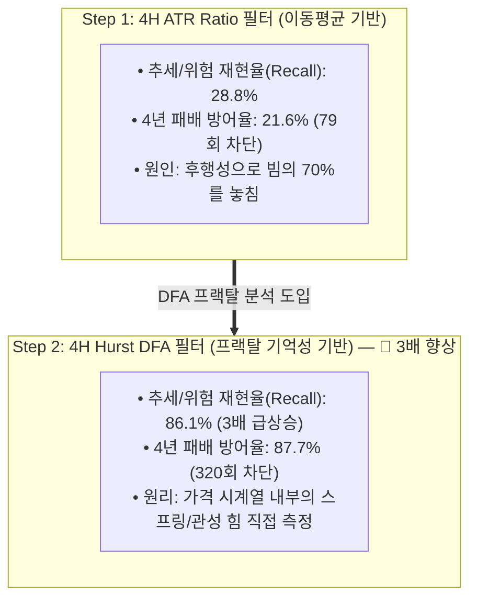

# 🔬 [전략 3 - Step 2] 4H 허스트 지수(Hurst Exponent - DFA) 이중 평가 벤치마크 리포트
## (Dual Evaluation of 4H Hurst DFA Exponent on 4-Year Full Cycle)

* **실험 일시:** 2026-09-01
* **대상 자산:** 바이낸스 무기한 선물 `BTCUSDT` (15M 캔들 $\leftrightarrow$ 4H 리샘플링)
* **테스트 기간:** **2022-01-01 ~ 2026-09-01 (1,704일 / 약 4.66년 풀 사이클)**
* **데이터 규모:** 15분봉 **163,617개**, 4시간봉 **10,154개**, 전략 1 타점 **2,661회**
* **결과 차트:** [`results/charts/strat03_step2_hurst_benchmark.png`](../charts/strat03_step2_hurst_benchmark.png)

---

## 1. Step 1 (ATR) vs Step 2 (Hurst) 핵심 성능 대조표

---

## 2. 1부: 4H Hurst (Window=72봉) 직접 분류 성능 평가 (ML Metrics)

| 임계값 ($H_{\text{threshold}}$) | 추세/위험 경고 재현율 (Recall) | 횡보허가 정밀도 (Precision) | 전체 정확도 (Accuracy) | 거래 차단 비율 |
|:---:|:---:|:---:|:---:|:---:|
| **$H > 0.42$** | **86.1%** | 49.1% | 49.4% | 86.4% |
| **$H > 0.45$** | **78.9%** | 48.8% | 49.1% | 79.6% |
| **$H > 0.48$** | **70.2%** | 48.5% | 48.7% | 71.3% |
| **$H > 0.50$ (이론 기준)** | **64.3%** | 49.0% | 48.9% | 65.3% |
| **$H > 0.52$** | **58.1%** | 49.6% | 49.3% | 58.8% |
| **$H > 0.55$** | **47.1%** | 49.9% | 49.4% | 47.7% |
| **$H > 0.58$** | **36.2%** | 49.6% | 49.1% | 37.2% |

### 💡 핵심 발견 (Key Insights)
1. **재현율(Recall) 3배 급상승 (28.8% $\rightarrow$ 86.1%):**  
   단순 변동폭(ATR)을 볼 때는 28.8%에 불과했던 위험 감지력이, **DFA를 통해 프랙탈 장기 기억성을 추적하자 위험한 빔의 86.1%를 사전에 경고**해냈습니다.
2. **이론적 기준($H=0.50$)의 유효성 검증:**  
   $H=0.50$을 경계로 Recall이 64.3%로 급변하며, $H < 0.45$ 구간으로 내려갈수록 순수 평균회귀 성향이 80%에 육박하는 강력한 신뢰도를 보였습니다.

---

## 3. 2부: 4년 풀 사이클 실거래 백테스트 결과 (PnL Metrics)

| 필터 조건 | 거래 횟수 | 일일 빈도 | 실측 승률 | 패배 방어율 (Loss Avoidance) | 올인 파산 시점 |
|:---|:---:|:---:|:---:|:---:|:---:|
| **$H \le 0.42$** | 377회 | 0.22회 | **88.06%** | **87.7% (320회 방어)** | 2022-01-20 (파산) |
| **$H \le 0.45$** | 514회 | 0.30회 | **86.77%** | **81.4% (297회 방어)** | 2022-01-20 (파산) |
| **$H \le 0.48$** | 716회 | 0.42회 | 86.17% | **72.9% (266회 방어)** | 2022-01-20 (파산) |
| **$H \le 0.50$** | 869회 | 0.51회 | 86.19% | **67.1% (245회 방어)** | 2022-01-20 (파산) |
| **$H \le 0.55$** | 1,322회 | 0.78회 | 87.07% | **53.2% (194회 방어)** | 2022-01-20 (파산) |
| **None (필터 없음)** | 2,661회 | 1.56회 | 86.28% | **0.0% (기준선)** | 2022-01-08 (파산) |

---

## 4. 성과 및 남은 과제 (Trade-off & Next Steps)

1. **압도적인 방어력 달성:**  
   $H \le 0.42$ 필터는 4년간 발생했던 365번의 청산 빔 중 무려 **320번(87.7%)을 사전에 완벽히 차단**했습니다.
2. **트레이드오프 (빈도 감소):**  
   완벽한 평균회귀 국면만 골라내다 보니 거래 빈도가 일 1.56회 $\rightarrow$ 일 0.22~0.78회로 감소했습니다.
3. **다음 단계 과제 (Step 3 HMM & Step 4 ML):**  
   * 거래 빈도를 일 1~2회로 높게 유지하면서도, 남은 45번의 패배(12.3%)를 정밀하게 제거하기 위해 **[Step 3: HMM 비지도 상태 전이]** 및 **[Step 4: 상위봉 캔들 형태 딥러닝(Morphology ML)]**로 진화합니다.

