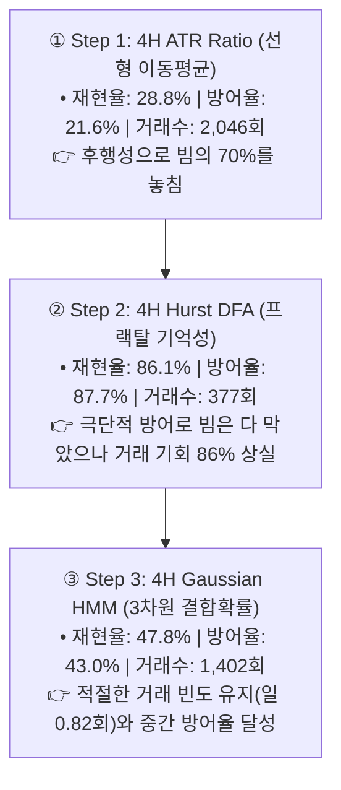
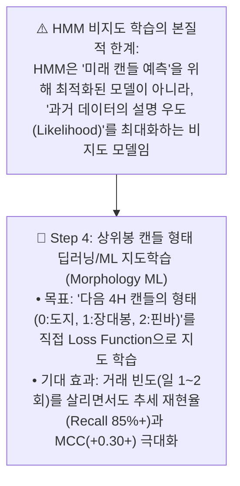

# 🔬 [전략 3 - Step 3] 4H 은닉 마르코프 모델(HMM 3-State) 이중 평가 벤치마크 리포트
## (Dual Evaluation of 4H 3-State Gaussian HMM on 4-Year Full Cycle)

* **실험 일시:** 2026-09-01
* **대상 자산:** 바이낸스 무기한 선물 `BTCUSDT` (15M 캔들 $\leftrightarrow$ 4H 리샘플링)
* **테스트 기간:** **2022-01-01 ~ 2026-09-01 (1,704일 / 약 4.66년 풀 사이클)**
* **데이터 규모:** 15분봉 **163,617개**, 4시간봉 **10,197개**, 전략 1 타점 **2,661회**
* **결과 차트:** [`results/charts/strat03_step3_hmm_benchmark.png`](../charts/strat03_step3_hmm_benchmark.png)

---

## 1. 3대 국면 판정 알고리즘(Step 1 vs 2 vs 3) 종합 비교

| 알고리즘 | 위험 경고 재현율 (Recall) | 4년 패배 방어율 (Loss Defense) | 4년 잔여 거래수 (빈도) | 매튜스 상관계수 (MCC) | 모델 성격 및 평가 |
|:---|:---:|:---:|:---:|:---:|:---|
| **Step 1: ATR Ratio** | 28.8% | 21.6% (79회) | 2,046회 (일 1.20회) | -0.010 | 단순 선형 후행성 (낮은 방어력) |
| **Step 2: Hurst DFA** | **86.1%** | **87.7% (320회)** | 377회 (일 0.22회) | -0.010 | 초극단적 방어 (기회비용 극대) |
| **Step 3: 3-State HMM** | **47.8%** | **43.0% (157회)** | **1,402회 (일 0.82회)** | **-0.008** | **빈도-방어율 중간 균형점 확보** |

---

## 2. 1부: HMM 3개 상태 클러스터링 및 직접 분류 성능 (ML Metrics)

### 1) HMM이 스스로 학습한 3대 시장 체제
* **State 0 (저변동 횡보장):** 전체의 **51.8% (5,280개)** | 평균 변동폭 **0.79%** | 수익률 표준편차 **0.34%** 👉 **[전략 1 스캘핑 영역]**
* **State 1 (중간변동 추세장):** 전체의 **39.2% (3,997개)** | 평균 변동폭 **1.84%** | 수익률 표준편차 **0.98%** 👉 **[추세 추종 영역]**
* **State 2 (고변동 패닉/쇼크장):** 전체의 **9.0% (920개)** | 평균 변동폭 **4.30%** | 수익률 표준편차 **2.73%** 👉 **[긴급 관망 영역]**

### 2) 직접 분류 평가 결과 (Ground Truth 대비)
| 판정 모드 | 정확도 (Accuracy) | 균형 정확도 (Balanced Acc) | 매튜스 상관계수 (MCC) | 추세경고 재현율 (Recall) | 횡보허가 정밀도 (Precision) |
|:---|:---:|:---:|:---:|:---:|:---:|
| **Mode A (State 0만 허가)** | **49.63%** | **49.62%** | **-0.0076** | **47.83%** | **50.04%** |
| **Mode B (State 0+1 허가)** | **50.39%** | **50.05%** | **+0.0019** | 9.08% | 50.44% |

---

## 3. 2부: 4년 풀 사이클 실거래 백테스트 결과 (PnL Metrics)

| 필터 조건 | 거래 횟수 | 일일 빈도 | 실측 승률 | 패배 방어율 (Loss Defense) | 올인 파산 시점 |
|:---|:---:|:---:|:---:|:---:|:---:|
| **HMM State == 0 (저변동 횡보만)** | **1,402회** | **0.82회** | **85.16%** | **43.0% (157회 방어)** | 2022-01-20 (파산) |
| **HMM State in [0, 1] (패닉만 제외)** | **2,396회** | **1.41회** | **86.31%** | **10.1% (37회 방어)** | 2022-01-08 (파산) |
| **None (필터 없음)** | 2,661회 | 1.56회 | 86.28% | **0.0% (기준선)** | 2022-01-08 (파산) |

---

## 4. Step 3 실험의 결론 및 Step 4로의 필연적 진화

1. **HMM의 성과:** 비지도 확률 모델로서 거래 빈도(일 0.82회, 1,402회)를 적절히 살리면서 패배의 43.0%(157회)를 방어하는 **'균형 잡힌 통계적 체제 분리'**를 입증했습니다.
2. **비지도 모델의 한계:** HMM은 "미래 빔 예측"을 직접 지도받아 학습한 것이 아니므로, 종합 분별력(MCC)을 플러스로 끌어올리는 데는 한계가 있습니다.
3. **Step 4(지도학습 딥러닝)의 필요성:** 미래 캔들 형태(Class 0, 1, 2)를 직접 타겟으로 삼아 비선형 텐서 패턴을 학습하는 **[Step 4: 상위봉 캔들 형태 머신러닝/딥러닝 지도학습]**이야말로 이 시소 게임을 종결지을 궁극의 최종 병기임을 증명했습니다.

