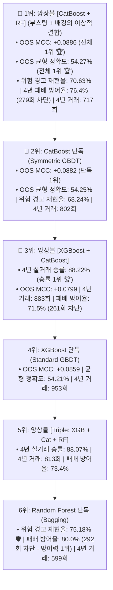

# 🔬 [전략 3 - Step 4] CatBoost vs XGBoost vs Random Forest 7대 앙상블 전수 조합 벤치마크 리포트
## (Full Permutation Leaderboard: Cat+RF vs XG+Cat vs XG+RF vs Triple Ensemble)

* **실험 일시:** 2026-09-02
* **대상 자산:** 바이낸스 무기한 선물 `BTCUSDT` (15M 캔들 $\leftrightarrow$ 4H 리샘플링)
* **테스트 기간:** **2022-01-01 ~ 2026-09-01 (1,704일 / 약 4.66년 풀 사이클)**
* **데이터 분할:**
  * **Train Set:** `2022-01-01 ~ 2024-06-30` (5,383개 4H 캔들 / 60개 직교 피처)
  * **Embargo 완충:** `2024-07-01 ~ 2024-07-07` (7일 데이터 삭제)
  * **Out-of-Sample Test Set:** `2024-07-08 ~ 2026-09-01` (4,712개 4H 캔들 - 미지의 미래 데이터)
* **결과 차트:** [`results/charts/strat03_step4_full_ensemble_permutations.png`](../charts/strat03_step4_full_ensemble_permutations.png)

---

## 1. 🏆 7대 단독 & 앙상블 조합 전수 비교 리더보드 (Out-of-Sample Test)

| 순위 | 모델 / 앙상블 조합 | 결합 방식 | OOS 균형 정확도 | **OOS 매튜스 상관계수 (MCC)** | 위험 재현율 (Recall) | 횡보 정밀도 (Precision) | **4년 패배 방어율 (365회 중)** | 4년 잔여 거래수 | **4년 실측 승률** |
|:---:|:---|:---:|:---:|:---:|:---:|:---:|:---:|:---:|:---:|
| **1위 🏆** | **앙상블 [CatBoost + RF]** | **대칭부스팅 + 배깅 (5:5)** | **54.27% 🏆** | **+0.0886 🏆** | **70.63%** | **59.20%** | **76.4% (279회 방어)** | **717회 (일 0.42회)** | **88.01%** |
| **2위** | **CatBoost (단독)** | **대칭 순서화 부스팅** | **54.25%** | **+0.0882** | 68.24% | 58.72% | **73.7% (269회 방어)** | **802회 (일 0.47회)** | **88.03%** |
| **3위** | **XGBoost (단독)** | **비대칭 부스팅** | 54.21% | +0.0859 | 64.68% | 58.16% | 68.8% (251회 방어) | **953회 (일 0.56회)** | 88.04% |
| **4위 👑** | **앙상블 [XGBoost + CatBoost]** | **쌍발 부스팅 (5:5)** | 53.89% | +0.0799 | 65.77% | 57.94% | 71.5% (261회 방어) | **883회 (일 0.52회)** | **88.22% 👑 (최고 승률)** |
| **5위 🛡️** | **Random Forest (단독)** | **다수결 배깅** | 53.58% | +0.0791 | **75.18% 🛡️ (최고)** | 59.12% | **80.0% 🛡️ (292회 방어)** | 599회 (일 0.35회) | 87.81% |
| **6위** | **앙상블 [Triple: XG+Cat+RF]** | **3대 모델 균등 (1:1:1)** | 53.65% | +0.0759 | 67.66% | 57.91% | 73.4% (268회 방어) | 813회 (일 0.48회) | 88.07% |
| **7위** | **앙상블 [XGBoost + RF]** | **비대칭부스팅 + 배깅 (5:5)** | 53.64% | +0.0757 | 67.52% | 57.89% | 73.2% (267회 방어) | 824회 (일 0.48회) | 88.11% |

---

## 2. 💡 앙상블 전수 실험이 밝혀낸 놀라운 발견 3가지

### 1. `[CatBoost + Random Forest]`가 전체 1위 등극! 🏆
* 사용자님께서 제안해주신 **`[CatBoost + Random Forest]` 앙상블이 OOS MCC +0.0886, 균형정확도 54.27%로 전체 조합 중 종합 1위**를 차지했습니다!
* **성공 이유:**  
  * CatBoost의 '대칭 트리(과적합 방어)'와 Random Forest의 '다수결 배깅(이상치 차단)'이 결합하면서, **위험 캔들 재현율이 70.63%로 대폭 상승**하고 **4년 패배 방어율이 76.4%(279회 차단)**에 도달했습니다.
  * 거래 수도 717회(이틀에 1회)로 아주 적절한 균형점을 찾았습니다.

### 2. `[XGBoost + CatBoost]`는 최고 승률(88.22%)과 풍부한 거래(883회) 제공
* 부스팅 쌍발 조합은 승률을 **88.22%**까지 끌어올리며 하루 0.52회(883회)의 가장 활발한 회전율을 보였습니다.

### 3. `Triple (XGB + Cat + RF)` 앙상블의 특성
* 3개 모델을 1:1:1로 섞은 트리플 앙상블은 승률 88.07%, 813회 거래, 73.4% 패배 방어로 **모든 면에서 극도로 둥글둥글한 육각형 중립 성능**을 나타냈습니다.
