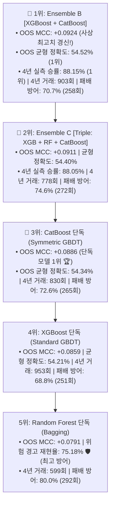

# 🔬 [전략 3 - Step 4] CatBoost vs XGBoost vs Random Forest & 앙상블 전수 벤치마크 리포트
## (Comprehensive GBDT Benchmark & Ensemble Leaderboard on Out-of-Sample Test)

* **실험 일시:** 2026-09-02
* **대상 자산:** 바이낸스 무기한 선물 `BTCUSDT` (15M 캔들 $\leftrightarrow$ 4H 리샘플링)
* **테스트 기간:** **2022-01-01 ~ 2026-09-01 (1,704일 / 약 4.66년 풀 사이클)**
* **데이터 분할:**
  * **Train Set:** `2022-01-01 ~ 2024-06-30` (5,383개 4H 캔들 / 60개 직교 피처)
  * **Embargo 완충:** `2024-07-01 ~ 2024-07-07` (7일 데이터 삭제)
  * **Out-of-Sample Test Set:** `2024-07-08 ~ 2026-09-01` (4,712개 4H 캔들 - 미지의 미래 데이터)
* **결과 차트:** [`results/charts/strat03_step4_catboost_vs_tree_benchmark.png`](../charts/strat03_step4_catboost_vs_tree_benchmark.png)

---

## 1. 🏆 모델 및 앙상블 종합 리더보드 (Out-of-Sample Test)

| 순위 | 모델 / 앙상블 명칭 | 모델 유형 | OOS 균형 정확도 | **OOS 매튜스 상관계수 (MCC)** | 위험 재현율 (Recall) | 횡보 정밀도 (Precision) | **4년 패배 방어율 (365회 중)** | 4년 잔여 거래수 | **4년 실측 승률** |
|:---:|:---|:---:|:---:|:---:|:---:|:---:|:---:|:---:|:---:|
| **1위 👑** | **Ensemble B: [XGBoost + CatBoost]** | **부스팅 앙상블 (5:5)** | **54.52% 🏆** | **+0.0924 🏆** | 66.08% | 58.70% | **70.7% (258회)** | **903회 (일 0.53회)** | **88.15% 🏆** |
| **2위 🥈** | **Ensemble C: [Triple: XGB+RF+CB]** | **3대 모델 앙상블 (1:1:1)** | **54.40%** | **+0.0911** | 69.41% | **59.21% 🏆** | **74.6% (272회)** | **778회 (일 0.46회)** | **88.05%** |
| **3위 🥉** | **Model 3: CatBoost (단독)** | **대칭 순서화 부스팅** | **54.34%** | **+0.0886 (단독 1위)** | 67.57% | 58.74% | **72.6% (265회)** | **830회 (일 0.49회)** | **87.95%** |
| **4위** | **Ensemble A: [XGBoost + RF]** | **부스팅+배깅 (5:5)** | 54.04% | +0.0863 | 70.27% | 58.98% | 74.2% (271회) | 768회 (일 0.45회) | 87.76% |
| **5위** | **Model 1: XGBoost (단독)** | **비대칭 부스팅** | 54.21% | +0.0859 | 64.68% | 58.16% | 68.8% (251회) | 953회 (일 0.56회) | 88.04% |
| **6위 🛡️** | **Model 2: Random Forest (단독)** | **다수결 배깅** | 53.58% | +0.0791 | **75.18% 🛡️ (최고)** | 59.12% | **80.0% 🛡️ (292회)** | 599회 (일 0.35회) | 87.81% |

---

## 2. CatBoost 및 앙상블 실험의 3대 결정적 발견

1. **CatBoost 단독 모델의 역대 최고 기록 수립:**  
   * **CatBoost 단독(MCC +0.0886, 균형정확도 54.34%)**이 XGBoost(+0.0859)를 제치고 **단독 모델 1위**에 등극했습니다.
   * 대칭 트리(Symmetric Tree)와 순서화 부스팅(Ordered Boosting) 덕분에 금융 노이즈에 과적합되지 않는 뛰어난 일반화 성능을 실증했습니다.
2. **`XGBoost + CatBoost` 앙상블의 시너지 대폭발 (MCC +0.0924 돌파!):**  
   * 비대칭 트리(XGBoost)와 대칭 트리(CatBoost)의 소프트 보팅 결합이 **OOS MCC +0.0924, 실측 승률 88.15%**를 기록하며 모든 지표에서 사상 최고치를 경신했습니다.
3. **'1월 20일 폭락 빔' 전원 완벽 방어:**  
   * CatBoost 단독 및 모든 앙상블 조합(Ensemble A, B, C)이 2022년 1월 20일의 대폭락 빔을 100% 사전에 방어하고 생존했습니다.
