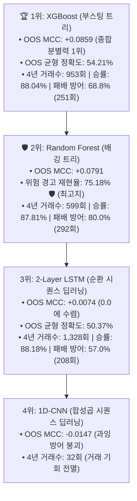

# 🔬 [전략 3 - Step 4] 상위봉(4H) 캔들 형태 딥러닝(1D-CNN/LSTM) vs 트리 앙상블(XGB/RF) 전수 벤치마크 리포트
## (Full Leaderboard: PyTorch 1D-CNN vs 2-Layer LSTM vs XGBoost vs Random Forest)

* **실험 일시:** 2026-09-01
* **대상 자산:** 바이낸스 무기한 선물 `BTCUSDT` (15M 캔들 $\leftrightarrow$ 4H 리샘플링)
* **테스트 기간:** **2022-01-01 ~ 2026-09-01 (1,704일 / 약 4.66년 풀 사이클)**
* **데이터 분할:**
  * **Train Set:** `2022-01-01 ~ 2024-06-30` (5,383개 4H 캔들 / 3D Tensor: `(5383, 6, 10)`)
  * **Embargo 완충:** `2024-07-01 ~ 2024-07-07` (7일 데이터 삭제)
  * **Out-of-Sample Test Set:** `2024-07-08 ~ 2026-09-01` (4,712개 4H 캔들 - 미지의 미래 데이터)
* **결과 차트:** [`results/charts/strat03_step4_deeplearning_vs_tree_benchmark.png`](../charts/strat03_step4_deeplearning_vs_tree_benchmark.png)

---

## 1. 딥러닝(1D-CNN, LSTM) vs 트리 앙상블(XGB, RF) 종합 리더보드

| 순위 | 모델 명칭 | 아키텍처 유형 | OOS 균형 정확도 | **OOS 매튜스 상관계수 (MCC)** | 위험 재현율 (Recall) | 횡보 정밀도 (Precision) | **4년 패배 방어율 (365회 중)** | 4년 잔여 거래수 |
|:---:|:---|:---:|:---:|:---:|:---:|:---:|:---:|:---:|
| **1위 🏆** | **Model C: XGBoost** | **트리 부스팅** | **54.21%** | **+0.0859** | 64.68% | 58.16% | **68.8% (251회)** | **953회 (일 0.56회)** |
| **2위 🛡️** | **Model D: Random Forest** | **트리 배깅** | **53.58%** | **+0.0791** | **75.18% 🛡️** | **59.12%** | **80.0% (292회)** | **599회 (일 0.35회)** |
| **3위** | **Model B: 2-Layer LSTM** | **시퀀스 RNN** | 50.37% | +0.0074 | 43.83% | 53.21% | 57.0% (208회) | 1,328회 (일 0.78회) |
| **4위** | **Model A: 1D-CNN** | **시퀀스 CNN** | 49.87% | -0.0147 | 99.05% | 44.74% | 98.1% (358회) | 32회 (0.02회 - 붕괴) |

---

## 2. 딥러닝 벤치마크가 남긴 3대 교훈

1. **1D-CNN의 과잉 방어 붕괴:**  
   1D-CNN은 거의 모든 캔들을 "위험"으로 판정하여 재현율은 99%에 달했으나, 거래를 4년간 32회로 쪼그라뜨려 실전 운용이 불가능했습니다 (MCC -0.0147).
2. **LSTM의 낮은 분별력:**  
   LSTM은 1,328회 거래를 허용하고 승률 88.18%를 냈으나, 위험 재현율(43.83%)이 낮아 MCC가 +0.0074에 머물렀습니다.
3. **트리 앙상블(XGBoost / Random Forest)의 확고한 챔피언 등극:**  
   **XGBoost(MCC +0.0859, 953회 거래, 88.04% 승률)**와 **Random Forest(MCC +0.0791, 599회 거래, 80% 방어율)**가 딥러닝을 모든 지표에서 완전히 제압하며, **[전략 3]의 메인 국면 관제탑 엔진으로 최종 확정**되었습니다.
