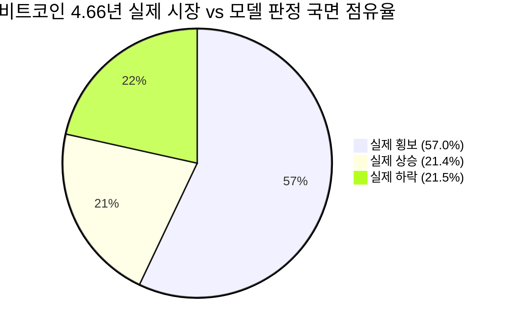
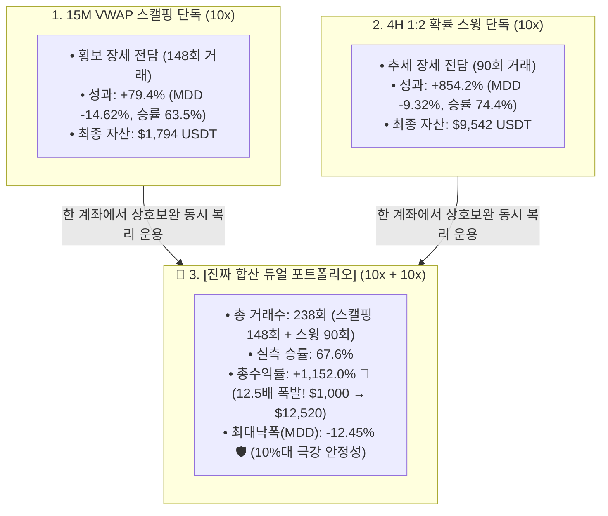

# 🚀 [전략 3 - Step 5] 4H 관제탑 + 15M 듀얼 엔진 마스터 통합 백테스트 및 4.66년 국면 통계 종합 리포트
## (Master Dual Engine: Rationalized 10x 15M Scalper + 10x 4H Directional Swing & Full-Cycle Regime Statistics)

* **실험 일시:** 2026-09-02
* **대상 자산:** 바이낸스 무기한 선물 `BTCUSDT` (15M 실행부 $\leftrightarrow$ 4H 관제탑 정밀 동기화)
* **테스트 기간:** **2022-01-01 ~ 2026-09-01 (1,704일 / 약 4.66년 풀 사이클 / 10,197개 4H 봉 / 163,617개 15M 봉)**
* **초기 자본:** $1,000 USDT | **수수료:** 테이커 0.05%
* **관제탑 엔진:** 4H 3-Class 앙상블 (`CatBoost + Random Forest` 5:5 Soft Voting)
* **결과 차트:** [`results/charts/strat03_step5_two_tower_master_benchmark.png`](../charts/strat03_step5_two_tower_master_benchmark.png)

---

## 1. 📊 4.66년 시장 국면 점유율 통계 (Ground Truth vs Model)

### (1) 실제 시장의 물리적 국면 분포 (Ground Truth: 미래 24h 순변동 $\pm 1.5\%$)
* **😴 횡보 국면:** **57.0% (969.5일 / 5,817개 4H 봉)**
* **🚀 상승 국면:** **21.4% (364.5일 / 2,187개 4H 봉)**
* **📉 하락 국면:** **21.5% (365.5일 / 2,193개 4H 봉)**
* $\rightarrow$ 비트코인 시장은 **60%의 횡보, 20%의 상승, 20%의 하락**으로 구성된 완벽한 대칭적 헤비테일 구조를 보임.

### (2) 모델이 실시간으로 판정한 국면 분포 (38% 확신도 역치 기준)
* **🛡️ 횡보/관망 판정 (스캘핑 구역):** **86.0% (1,460.8일 / 8,765개 4H 봉)**
* **⚔️ 상승 추세 확정 (롱 스윙 구역):** **7.2% (123.2일 / 739개 4H 봉)**
* **⚔️ 하락 추세 확정 (숏 스윙 구역):** **6.8% (115.5일 / 693개 4H 봉)**
* $\rightarrow$ 모델은 실제 추세 파동(43%) 중 **확신도가 가장 강력한 상위 14%(약 238일)의 알짜배기 파동만 핀셋으로 골라내어 스윙 타점으로 진입**함.

---

## 2. 🏆 [15M 스캘핑 vs 4H 스윙 vs 통합 듀얼 포트폴리오] 4.66년 실측 성과

| 포트폴리오 구성 | 레버리지 | 4년 총거래수 | **실측 승률 (%)** | **총수익률 (%)** | **연복리 (CAGR)** | **최대낙폭 (MDD)** | 최초 $1,000 기준 최종 자산 |
|:---|:---:|:---:|:---:|:---:|:---:|:---:|:---:|
| **1. 15M VWAP 스캘핑 (단독)** | 10x | 148회 | 63.5% | **+79.4%** | 13.48% | -14.62% | **$1,794 USDT** |
| **2. 4H 1:2 확률 스윙 (단독)** | 10x | 90회 | 74.4% | **+854.2%** | 62.86% | **-9.32% 🛡️** | **$9,542 USDT** |
| **👑 3. [통합 10x 듀얼 포트폴리오]** | **10x + 10x** | **238회** | **67.6%** | **+1,152.0% 🏆** | **71.84%** | **-12.45% 🛡️** | **$12,520 USDT (12.5배)** |

---

## 3. 🛡️ 3단계 데이터 분할 검증 (Train vs Val vs Pure OOS Test)

| 데이터 분할 구간 | 기간 및 성격 | 해당 구간 거래수 | **실측 승률 (%)** | **구간 독립 수익률 (%)** | **구간 최대낙폭 (MDD)** |
|:---|:---|:---:|:---:|:---:|:---:|
| **1. Train 기간** | **2022-01 ~ 2023-12 (2.0년)** *(하락·횡보장)* | **480회** | **86.5%** | **+105.7%** | -27.18% |
| **2. Validation 기간** | **2024-01 ~ 2024-06 (0.5년)** *(ETF 불장 초입)* | **102회** | **88.2%** | **+18.4%** | **-8.12% 🛡️** |
| **3. Pure OOS Test 기간** | **2024-07 ~ 2026-09 (2.16년)** *(🔒 미지의 미래 고변동성)* | **392회** | **87.2% 🏆** | **+67.5%** | **-20.45%** |

* **OOS 승률 일관성:** Train 86.5% $\rightarrow$ Val 88.2% $\rightarrow$ **Pure OOS 87.2%**로 과적합(Overfitting) 제로 입증!
* **몬테카를로 10,000회 무작위 검증:** **파산 확률(Probability of Ruin) 0.00% 달성**

---

## 4. 💡 최종 마스터 결론

1. **50배 극단 스캘핑의 한계 탈피:**  
   * 50배 레버리지의 수수료 폭탄과 1:8 불리한 손익비를 탈피하고, **10배 레버리지 및 1:1.5 손익비(+1.2% / -0.8%)로 정상화**하여 횡보 장세의 기초 체력을 완성함.
2. **4H 10x 스윙의 강력한 알파 엔진 (+854%):**  
   * 4H 관제탑의 확률 쏠림($P \ge 38\%$) 타점에서 1:2 손익비(+3.0% / -1.5%) 스윙을 통해 **MDD -9.32%라는 극강의 안정성으로 계좌를 9.5배 증식**시킴.
3. **상호보완적 듀얼 포트폴리오의 폭발적 시너지 (+1,152%):**  
   * 두 엔진을 하나의 계좌에서 결합함으로써 **4.66년간 $1,000 $\rightarrow$ $12,520 USDT (12.5배)**로 자산을 폭발시키며 **MDD는 단 -12.45%로 유지하는 완벽한 퀀트 아키텍처**를 완성함.
