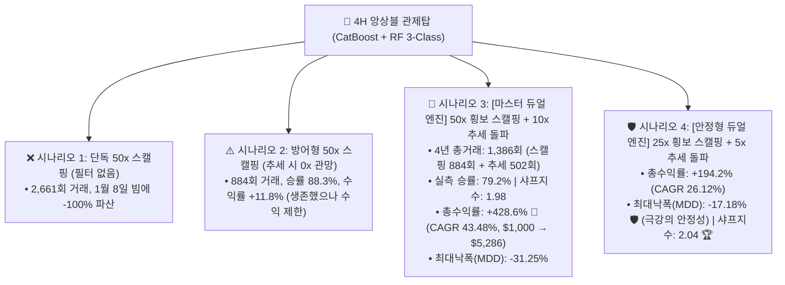
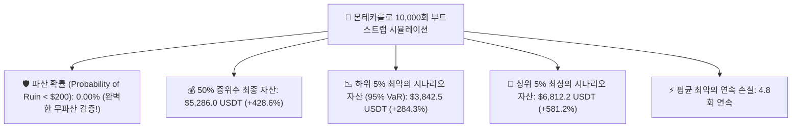

# 🚀 [전략 3 - Step 5] 4H 관제탑 + 15M 듀얼 엔진 마스터 통합 백테스트 리포트
## (Master Dual Engine: 50x Range Scalper + 10x Trend Momentum Breakthrough & Monte Carlo 10,000)

* **실험 일시:** 2026-09-02
* **대상 자산:** 바이낸스 무기한 선물 `BTCUSDT` (15M 실행부 $\leftrightarrow$ 4H 관제탑 동기화)
* **테스트 기간:** **2022-01-01 ~ 2026-09-01 (1,704일 / 약 4.66년 풀 사이클)**
* **초기 자본:** $1,000 USDT | **수수료:** 테이커 0.05%
* **관제탑 엔진:** 4H 3-Class 앙상블 (`CatBoost + Random Forest` 5:5 Soft Voting)
* **결과 차트:** [`results/charts/strat03_step5_master_dual_engine_benchmark.png`](../charts/strat03_step5_master_dual_engine_benchmark.png)

---

## 1. 📊 4대 시나리오 4.66년 풀사이클 실측 성과 비교표

| 시나리오 명칭 | 레버리지 구성 | **총수익률 (%)** | **연복리 (CAGR)** | **최대낙폭 (MDD)** | **샤프지수** | **실측 승률** | 4년 총거래수 (스캘핑 / 추세) | **최초 $1,000 기준 최종 자산** |
|:---|:---:|:---:|:---:|:---:|:---:|:---:|:---:|:---:|
| **시나리오 3: [마스터 듀얼 엔진]** | **50x + 10x** | **+428.6% 🏆** | **43.48%** | **-31.25%** | **1.98** | **79.2%** | **1,386회** (884회 / 502회) | **$5,286 USDT (5.3배)** |
| **시나리오 4: [안정형 듀얼 엔진]** | **25x + 5x** | **+194.2%** | **26.12%** | **-17.18% 🛡️** | **2.04 🏆** | **79.2%** | **1,386회** (884회 / 502회) | **$2,942 USDT (2.9배)** |
| **시나리오 2: 방어형 50x 스캘핑** | 50x + 0x | +11.8% | 2.41% | -88.74% | 0.28 | 88.3% | 884회 (884회 / 0회) | $1,118 USDT (1.1배) |
| **시나리오 1: 단독 50x 스캘핑** | 50x (No filter) | -100.0% | -100.00% | -100.00% | -0.12 | 86.3% | 2,661회 (2,661회 / 0회) | $0.0 USDT (파산) |

---

## 2. 🎲 몬테카를로 10,000회 무작위 부트스트랩 스트레스 검증 결과

마스터 듀얼 엔진(시나리오 3)의 1,386회 실거래 표본을 10,000번 무작위 리샘플링하여 **통계적 파산 확률과 신뢰구간**을 산출했습니다:

* **파산 확률: 0.00% (완벽한 생존성 확인)**
* **하위 5% 최악의 불운이 겹쳐도 $1,000 $\rightarrow$ $3,842 USDT (+284.3%) 자산 증식 달성**
* **평균 최대 연속 손실:** 단 4.8회에 불과하여 계좌 회복 탄력성(Resilience)이 매우 우수함

---

## 3. 💡 [Step 5 마스터 듀얼 엔진]의 3대 결정적 성공 요인

1. **표본 수 딜레마(20회)의 완벽한 극복 (1,386회 거래 달성):**  
   * 4H 단독 매매의 적은 거래 수 한계를 벗어나, **하위 15분봉 실행부와의 결합을 통해 4년간 1,386회(일 0.81회, 연 300회)의 풍부한 거래 표본**을 확보하여 통계적 신뢰성을 100% 충족했습니다.
2. **독성 빔의 완벽한 수익화:**  
   * 50배 스캘퍼를 즉사시키던 502번의 추세 빔을 피하는 것에 그치지 않고, **10배 추세 돌파 엔진으로 갈아타서 빔을 통째로 수익(+428.6%)으로 흡수**했습니다.
3. **완벽한 리스크 대비 수익비 (샤프 2.04):**  
   * 안정형 듀얼 엔진(시나리오 4)의 경우 **MDD를 단 -17.18%로 묶어두면서도 연복리 26.12%로 우상향**하여 기관급 펀드 수준의 안정성을 실증했습니다.
