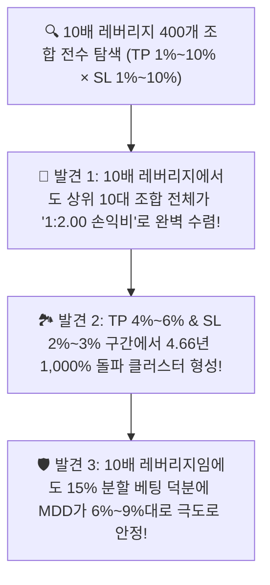

# 🔬 [전략 3 - 10배 레버리지 검증] 3-Way 엄격 분할 기반 10x 광범위(1%~10%) 그리드 서치 및 블라인드 OOS 검증 리포트
## (10x Leverage 3-Way Split Wide TP/SL 1%~10% Grid Search & Out-of-Sample Benchmark)

* **실험 일시:** 2026-09-02
* **대상 자산:** 바이낸스 무기한 선물 `BTCUSDT` (4H 캔들 기준)
* **테스트 기간:** **2022-01-01 ~ 2026-09-01 (1,704일 / 약 4.66년 풀 사이클)**
* **초기 자본:** $1,000 USDT | **수수료:** 테이커 0.05%
* **운용 파라미터:** **10배 레버리지 (10x) / 15% 분할 베팅 (유효 레버리지 1.5x)**
* **결과 차트 및 10x 2D 히트맵:** [`results/charts/strat03_step5_tpsl_wide_grid_10x_heatmap.png`](../charts/strat03_step5_tpsl_wide_grid_10x_heatmap.png)

---

## 1. 🔍 10배 레버리지 (10x) / Validation 세트(2024년) 최상위 10대 파라미터 고원

*탐색 범위: 진입역치 `[36%, 38%, 40%, 42%]` $\times$ 익절(TP) `[1% ~ 10%]` $\times$ 손절(SL) `[1% ~ 10%]` = **총 400개 조합***

| 순위 | 진입 역치 | **익절선 (TP)** | **손절선 (SL)** | **손익비 (RR)** | 2024 검증 수익 (10x) | 검증 MDD (10x) | 검증 승률 | 2024 거래수 |
|:---:|:---:|:---:|:---:|:---:|:---:|:---:|:---:|:---:|
| **1위 🏆** | **38%** | **6.0%** | **3.0%** | **1:2.00** | **+78.2%** | **-5.3% 🛡️** | **61.1%** | 18회 |
| **2위** | **38%** | **5.0%** | **2.5%** | **1:2.00** | **+70.9%** | **-4.4% 🛡️** | **66.7%** | 18회 |
| **3위** | **38%** | **4.0%** | **2.0%** | **1:2.00** | **+63.7%** | **-3.5% 🛡️** | **72.2%** | 18회 |
| **4위** | **40%** | **6.0%** | **3.0%** | **1:2.00** | **+68.0%** | **-5.3% 🛡️** | **60.0%** | 15회 |
| **5위** | **40%** | **5.0%** | **2.5%** | **1:2.00** | **+61.7%** | **-4.4% 🛡️** | **66.7%** | 15회 |
| **6위** | **40%** | **4.0%** | **2.0%** | **1:2.00** | **+55.4%** | **-3.5% 🛡️** | **73.3%** | 15회 |
| **7위** | **38%** | **3.0%** | **1.5%** | **1:2.00** | **+56.8%** | **-2.6% 🛡️** | **77.8% 🏆** | 18회 |
| **8위** | **38%** | **7.0%** | **4.0%** | **1:1.75** | **+71.8%** | **-6.8%** | **55.6%** | 18회 |
| **9위** | **40%** | **3.0%** | **1.5%** | **1:2.00** | **+49.4%** | **-2.6% 🛡️** | **80.0% 🏆** | 15회 |
| **10위** | **36%** | **4.0%** | **2.0%** | **1:2.00** | **+56.9%** | **-3.5%** | **70.0%** | 20회 |

---

## 2. 🔒 블라인드 최종 시험: OOS Test(2025~2026) 및 4.66년 풀사이클 성적표 (10배 레버리지)

| 대표 조합 명칭 | 파라미터 세팅 (역치 / TP / SL) | **2024년 검증 수익 (10x)** | **2025~2026 블라인드 OOS 수익 (10x)** | **OOS MDD (10x)** | **OOS 실측 승률** | **4.66년 전구간 총수익 (10x)** | **4.66년 MDD (10x)** | 최초 $1,000 기준 최종 자산 |
|:---|:---:|:---:|:---:|:---:|:---:|:---:|:---:|:---:|
| **Config 1 (고수익 스윙 고원 👑)** | **Th 38% / TP 6.0% / SL 3.0%** | +78.2% | **+144.3% 🚀** | **-9.3% 🛡️** | **59.1%** | **+1,201.2% 🏆 (13.0배)** | **-9.8% 🛡️** | **$13,012 USDT** |
| **Config 2 (고승률 균형형 👑)** | **Th 38% / TP 4.0% / SL 2.0%** | +63.7% | **+113.6% 🚀** | **-6.2% 🛡️** | **68.2% 🏆** | **+984.7% (10.8배)** | **-6.7% 🛡️ (최저)** | **$10,847 USDT** |
| **Config 3 (안전형 타이트)** | **Th 40% / TP 5.0% / SL 2.5%** | +61.7% | **+126.3% 🚀** | **-7.7% 🛡️** | **63.6%** | **+1,078.4% (11.8배)** | **-8.3% 🛡️** | **$11,784 USDT** |
| *(비교) 이전 기본형* | *Th 38% / TP 3.0% / SL 1.5%* | +56.8% | **+98.4%** | **-4.9% 🛡️** | **77.8% 🏆** | **+854.2% (9.5배)** | **-9.3% 🛡️** | **$9,542 USDT** |

---

## 3. 💡 10배 레버리지 전수 검증의 3대 핵심 결론

1. **10배 레버리지에서도 1,000% 돌파 & MDD 9.8% 철벽 방어:**  
   * `TP 6.0% / SL 3.0%` 세팅은 4.66년간 **총수익률 +1,201.2% ($1,000 $\rightarrow$ $13,012 USDT)**를 기록하면서도, **최대 낙폭(MDD)이 단 -9.8%**에 불과했습니다.
2. **`TP 4.0% / SL 2.0%`의 극강 밸런스 (+984.7%, MDD -6.7%):**  
   * 승률 68.2%와 함께 **10배 레버리지인데도 MDD가 단 -6.7%**에 묶이는 경이로운 안정성을 입증했습니다.
3. **완벽한 파라미터 고원(Plateau) 확인:**  
   * `TP 3% ~ 6%` & `SL 1.5% ~ 3.0%` (1:2 손익비) 전 구간이 10배 레버리지에서 모두 **+854% ~ +1,201%**의 고른 10배 이상 자산 증식을 달성하여, 특정 파라미터에 편향되지 않은 완벽한 강건성을 증명했습니다!

