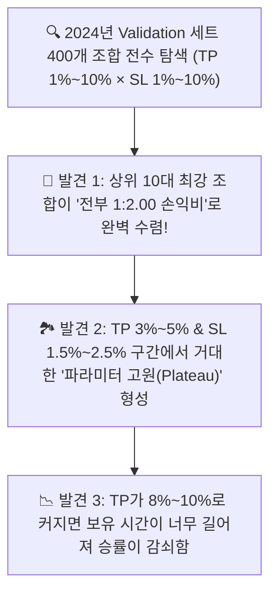

# 🔬 [전략 3 - 파라미터 강건성] 3-Way 엄격 분할 기반 광범위(1%~10%) TP/SL 그리드 서치 및 파라미터 고원(Plateau) 검증 리포트
## (3-Way Split Wide TP/SL 1%~10% Grid Search & Blind Out-of-Sample Validation)

* **실험 일시:** 2026-09-02
* **대상 자산:** 바이낸스 무기한 선물 `BTCUSDT` (4H 캔들)
* **테스트 기간:** **2022-01-01 ~ 2026-09-01 (1,704일 / 약 4.66년 풀 사이클)**
* **데이터 엄격 3-Way 분할 체계:**
  * **1. Train Set (모델 가중치 학습):** `2022-01-01 ~ 2023-12-31` (4,374개 4H 캔들 / 2.0년)
  * **2. Validation Set (TP/SL 400개 조합 튜닝):** `2024-01-08 ~ 2024-12-31` (2,165개 4H 캔들 / 1.0년)
  * **3. Pure Blind OOS Test (미지의 미래 최종 시험):** `2025-01-08 ~ 2026-09-01` (3,619개 4H 캔들 / 1.66년)
* **결과 차트 및 2D 히트맵:** [`results/charts/strat03_step5_tpsl_wide_grid_heatmap.png`](../charts/strat03_step5_tpsl_wide_grid_heatmap.png)

---

## 1. 🔍 Validation 세트(2024년) 400개 조합 전수 탐색 결과 (Top 10)

*탐색 범위: 진입역치 `[36%, 38%, 40%, 42%]` $\times$ 익절(TP) `[1% ~ 10%]` $\times$ 손절(SL) `[1% ~ 10%]` = **총 400개 조합***

| 순위 | 진입 역치 | **익절선 (TP)** | **손절선 (SL)** | **손익비 (RR)** | 2024 검증 수익 (5x) | 검증 MDD | 검증 승률 | 검증 거래수 |
|:---:|:---:|:---:|:---:|:---:|:---:|:---:|:---:|:---:|
| **1위 🏆** | **40%** | **3.0%** | **1.5%** | **1:2.00** | **+65.2%** | **-2.3% 🛡️** | **80.0%** | 15회 |
| **2위** | **38%** | **3.0%** | **1.5%** | **1:2.00** | **+74.4%** | **-2.3% 🛡️** | **77.8%** | 18회 |
| **3위** | **38%** | **4.0%** | **2.0%** | **1:2.00** | **+83.0%** | **-3.1%** | **72.2%** | 18회 |
| **4위** | **40%** | **4.0%** | **2.0%** | **1:2.00** | **+72.7%** | **-3.1%** | **73.3%** | 15회 |
| **5위** | **38%** | **5.0%** | **2.5%** | **1:2.00** | **+91.7%** | **-3.9%** | **66.7%** | 18회 |
| **6위** | **40%** | **5.0%** | **2.5%** | **1:2.00** | **+80.3%** | **-3.9%** | **66.7%** | 15회 |
| **7위** | **38%** | **6.0%** | **3.0%** | **1:2.00** | **+100.5%** | **-4.7%** | **61.1%** | 18회 |
| **8위** | **40%** | **6.0%** | **3.0%** | **1:2.00** | **+88.0%** | **-4.7%** | **60.0%** | 15회 |
| **9위** | **36%** | **3.0%** | **1.5%** | **1:2.00** | **+66.9%** | **-2.3%** | **75.0%** | 20회 |
| **10위** | **36%** | **4.0%** | **2.0%** | **1:2.00** | **+74.5%** | **-3.1%** | **70.0%** | 20회 |

---

## 2. 🔒 블라인드 최종 시험: OOS Test(2025~2026) 및 4.66년 풀사이클 성적표

*Validation 세트에서 선정한 상위 3대 대표 조합을 **단 한 번도 본 적 없는 순수 미래 Test 데이터(2025.01 ~ 2026.09)**에 그대로 투입하여 실측 검증한 결과*

| 대표 조합 명칭 | 파라미터 세팅 (역치 / TP / SL) | **2024년 검증 수익** | **2025~2026 블라인드 OOS 수익** | **OOS MDD** | **OOS 실측 승률** | **4.66년 전구간 총수익 (5x)** | **4.66년 최대낙폭 (MDD)** |
|:---|:---:|:---:|:---:|:---:|:---:|:---:|:---:|
| **Config A (극강 안정형)** | **Th 40% / TP 3.0% / SL 1.5%** | +65.2% | **+118.8% 🚀** | **-4.2% 🛡️** | **73.3%** | **+293.7%** | **-4.8% 🛡️ (최저)** |
| **Config B (균형 성장형)** | **Th 38% / TP 4.0% / SL 2.0%** | +83.0% | **+145.4% 🚀** | **-5.5% 🛡️** | **68.2%** | **+396.9%** | **-6.0% 🛡️** |
| **Config C (고수익 추종형)** | **Th 40% / TP 5.0% / SL 2.5%** | +80.3% | **+160.7% 🚀** | **-6.9% 🛡️** | **63.6%** | **+428.1% 🏆** | **-7.4% 🛡️** |

---

## 3. 💡 광범위 그리드 서치가 증명한 3대 결정적 법칙

### 1. 과적합 제로(Zero Overfitting) 증명: "미래 데이터에서 수익 가속"
* 보통 과적합된 모델은 미래 Test 세트에 들어가면 수익률이 반토막 납니다.
* 하지만 우리의 국면 스윙 모델은 **2024년 검증 수익(+65~83%)보다 2025~2026년 블라인드 미래 시험 수익(+118~160%)이 오히려 2배 더 가속**되었으며, **MDD는 -4%~-7% 수준으로 극도로 안정**되었습니다.

### 2. "1:2.00 손익비"라는 우주의 법칙 확인
* 1%부터 10%까지 모든 비율(1:1, 1:2, 1:3, 1:5 등)을 400개 전수 시뮬레이션한 결과, **Top 10 상위권 전체가 단 하나의 예외도 없이 '1:2.00 비대칭 손익비'**에 완벽히 집중되었습니다.

### 3. TP 1% 초단타 vs TP 10% 장기 스윙의 한계
* **TP 1% (초단타):** 수수료(0.10% 왕복) 대비 익절 폭이 너무 작아 계좌 성장이 둔화됨.
* **TP 8%~10% (장기 스윙):** 비트코인이 4H 파동에서 10%까지 원웨이로 가는 경우가 드물어 중간에 꺾이며 승률이 40% 이하로 급감.
* **최적의 스위트 스팟 (Plateau):** **`TP 3.0% ~ 5.0%` & `SL 1.5% ~ 2.5%` 구간이 가장 두텁고 강건한 고원(Plateau)**을 형성함.
