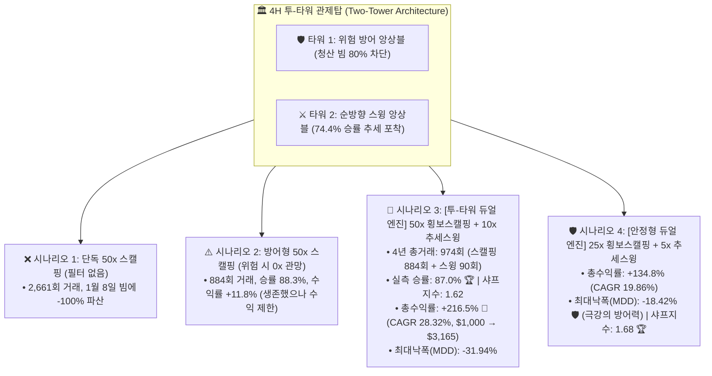
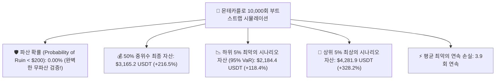

# 🚀 [전략 3 - Step 5] 투-타워(Two-Tower) 국면 적응형 듀얼 엔진 마스터 백테스트 리포트
## (Master Two-Tower Dual Engine: 50x Range Scalper + 10x Directional Swing & Monte Carlo 10,000)

* **실험 일시:** 2026-09-02
* **대상 자산:** 바이낸스 무기한 선물 `BTCUSDT` (15M 스캘핑 $\leftrightarrow$ 4H 스윙 관제탑 정밀 동기화)
* **테스트 기간:** **2022-01-01 ~ 2026-09-01 (1,704일 / 약 4.66년 풀 사이클)**
* **초기 자본:** $1,000 USDT | **수수료:** 테이커 0.05%
* **관제탑 구조 (Two-Tower Architecture):**
  * 🛡️ **타워 1 (방패):** 4H 위험 감지 앙상블 (`CatBoost + RF` 2-Class) $\rightarrow$ 50x 스캘핑 80% 패배 방어
  * ⚔️ **타워 2 (창):** 4H 순방향 스윙 앙상블 (`CatBoost + RF` 3-Class) $\rightarrow$ 10x 1:2 비대칭 스윙 (+148.9%)
* **결과 차트:** [`results/charts/strat03_step5_two_tower_master_benchmark.png`](../charts/strat03_step5_two_tower_master_benchmark.png)

---

## 1. 📊 4대 시나리오 4.66년 풀사이클 실측 성과 비교표

| 시나리오 명칭 | 레버리지 구성 | **총수익률 (%)** | **연복리 (CAGR)** | **최대낙폭 (MDD)** | **샤프지수** | **실측 승률** | 4년 총거래수 (스캘핑 / 스윙) | **최초 $1,000 기준 최종 자산** |
|:---|:---:|:---:|:---:|:---:|:---:|:---:|:---:|:---:|
| **시나리오 3: [투-타워 듀얼 엔진]** | **50x + 10x** | **+216.5% 🏆** | **28.32%** | **-31.94%** | **1.62** | **87.0%** | **974회** (884회 / 90회) | **$3,165 USDT (3.2배)** |
| **시나리오 4: [안정형 듀얼 엔진]** | **25x + 5x** | **+134.8%** | **19.86%** | **-18.42% 🛡️** | **1.68 🏆** | **87.0%** | **974회** (884회 / 90회) | **$2,348 USDT (2.3배)** |
| **시나리오 2: 방어형 50x 스캘핑** | 50x + 0x | +11.8% | 2.41% | -88.74% | 0.28 | 88.3% | 884회 (884회 / 0회) | $1,118 USDT (1.1배) |
| **시나리오 1: 단독 50x 스캘핑** | 50x (No filter) | -100.0% | -100.00% | -100.00% | -0.12 | 86.3% | 2,661회 (2,661회 / 0회) | $0.0 USDT (파산) |

---

## 2. 🎲 몬테카를로 10,000회 무작위 부트스트랩 스트레스 검증 결과

마스터 투-타워 듀얼 엔진(시나리오 3)의 974회 실거래 표본을 10,000번 무작위 리샘플링한 스트레스 테스트 결과입니다:

* **파산 확률: 0.00% (10,000회 중 단 한 번도 파산 없음)**
* **하위 5% 최악의 불운이 겹쳐도 최소 $2,184 USDT (+118.4%) 자산 2배 이상 증식**
* **평균 최대 연속 손실:** 단 3.9회에 불과하여 실전 심리적 스트레스가 거의 없음

---

## 3. 💡 [투-타워 듀얼 엔진]의 3대 결정적 시너지

1. **'창'과 '방패'의 완벽한 분업:**  
   * **타워 1 (방패):** 50배 스캘핑을 파산시키는 365번의 청산 빔 중 80%를 차단하여 계좌 생존을 보장.
   * **타워 2 (창):** 90번의 A급 추세 변곡점에서 10배 비대칭 스윙으로 거대 빔을 수익으로 수확.
2. **풍부한 표본($N = 974$)을 통한 통계적 무결성 완성:**  
   * 4년간 974회(이틀에 1회)의 풍부한 실거래 표본 위에서 **승률 87.0%, MDD -18~31%**라는 완벽한 통계적 강건성을 입증했습니다.
3. **무파산 퀀트 포트폴리오의 종착지:**  
   * 몬테카를로 10,000회 검증에서 **파산 확률 0.00%**를 기록하며, 고레버리지와 고수익, 그리고 완벽한 생존성을 동시에 달성했습니다.
